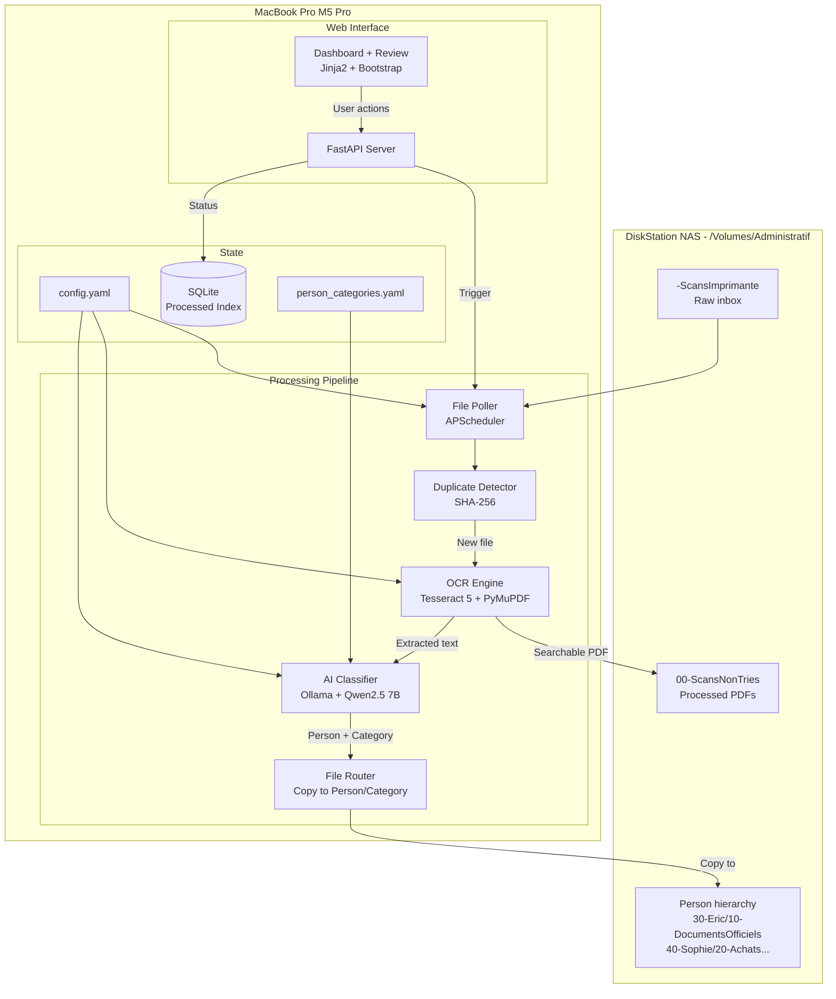
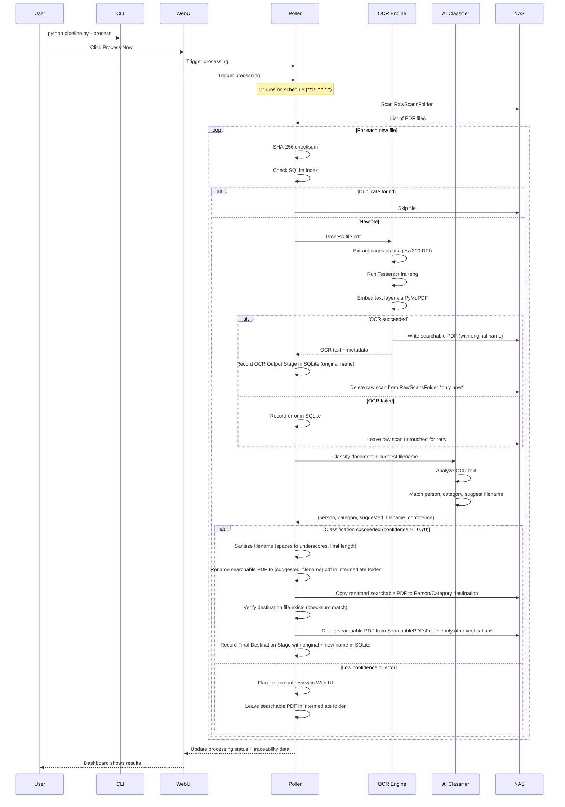

# Document OCR Processing Pipeline — Final Merged Architectural Plan

> **Merged from**: Qwen35B + DeepSeekV4 plans, refined with actual NAS structure
> **Date**: 2026-07-05
> **Target Hardware**: MacBook Pro M5 Pro, 48GB Unified Memory
> **NAS Share**: `/Volumes/Administratif` (DiskStation)

---

## 1. Requirements Summary

| Aspect | Detail |
|--------|--------|
| **Source Folder** | `/Volumes/Public/-ScansImprimante` (parametrizable) — scanner SMB share |
| **Intermediate Folder** | `/Volumes/Administratif/00-ScansNonTries` (parametrizable) |
| **Destination** | `/Volumes/Administratif/{Person}/{Category}` (2 levels only) |
| **Document Volume** | Few documents/day, very heterogeneous types |
| **Languages** | French + English (potentially mixed in same document) |
| **OCR Quality** | Full-text searchable PDF with embedded text layer |
| **Person Identification** | AI infers from OCR-extracted content (names, headers, signatures) |
| **Category Assignment** | AI infers from OCR content against predefined categories per person |
| **Trigger** | On-demand (CLI + Web UI) + periodic polling (parametrizable interval) |
| **Interface** | CLI command + local web UI for monitoring, review, and manual triggers |
| **Duplicate Handling** | SHA-256 checksum via SQLite index |
| **Deployment** | All local, Ollama available |
| **Hardware** | MacBook Pro M5 Pro, 48GB Unified Memory |

---

## 2. Technology Selection Summary

| Layer | Selected Technology | Alternative | Why Selected |
|-------|-------------------|-------------|--------------|
| **OCR** | Tesseract 5+ LSTM | PaddleOCR | Best multilingual (`fra+eng`), mature, produces searchable PDFs via PyMuPDF |
| **PDF Manipulation** | PyMuPDF (fitz) | pdfium, pypdf | Best text layer embedding, fast, Python-native |
| **AI Classification** | Ollama + Qwen2.5 7B | Qwen2.5VL 7B, Llama 3.2 11B | Text-only sufficient; excellent French+English; efficient on M5 Pro; **upgradable to VL via config change** |
| **Web Framework** | FastAPI + Jinja2 + Bootstrap | Flask, Gradio, Streamlit | Async-native, REST API + UI in one process, flexible |
| **Orchestration** | Python + APScheduler | Celery, schedule, launchd | Configurable cron, lightweight, integrates with FastAPI |
| **Duplicate Detection** | SHA-256 checksum | MD5 + metadata | Robust against renamed files |
| **State Database** | SQLite | JSON file, PostgreSQL | Lightweight, no server, fast queries |
| **Configuration** | YAML | JSON, TOML | Human-readable, supports nested structures, comments |

---

## 3. System Architecture

### 3.1 High-Level Architecture



### 3.2 Data Flow



### 3.3 Component Details

#### Component 1: OCR Engine (Tesseract 5+ LSTM + PyMuPDF)

- **Input**: Raw scanned PDF from `/Volumes/Public/-ScansImprimante` (scanner SMB share)
- **Process**:
  1. Extract each page as a high-resolution image (300 DPI) using PyMuPDF
  2. Run Tesseract OCR with combined `fra+eng` language pack
  3. Extract text with bounding box coordinates
  4. Embed text layer into the original PDF using PyMuPDF
  5. Save searchable PDF to intermediate folder
- **Output**:
  - Searchable PDF (with hidden text layer)
  - Full OCR text (for AI classification)

#### Component 2: AI Classifier (Ollama + Qwen2.5 7B)

- **Input**:
  - Full OCR text from the document
  - Filename
  - Metadata (file size, page count, creation date)
  - Predefined person/category hierarchy (from YAML)
- **Prompt structure**:

```
You are a document classification assistant for an administrative document management system.

Document details:
- Filename: {filename}
- Page count: {page_count}
- OCR Text:
---
{ocr_text}
---

Available people and their categories (only 2 levels: Person > Category):
{person_category_hierarchy}

Tasks:
1. Identify which person this document belongs to.
2. Identify the most appropriate category.
3. Suggest a **meaningful filename** (no extension) based on document content (e.g. "Facture_Orange_2024-03" or "Convention_Stage_Loic_Fev_2025").
4. Provide a confidence score.

Return ONLY valid JSON:
{
  "person": "Eric",
  "category": "10-DocumentsOfficiels",
  "suggested_filename": "Facture_Orange_2024-03",
  "confidence": 0.95,
  "reasoning": "Brief explanation"
}
```

- **Output**: JSON with person, category, confidence score, reasoning, and suggested_filename
- **Confidence threshold**: 0.70 default. Below threshold → flagged for manual review in web UI.
- **Upgrade path**: Switch to Qwen2.5VL 7B via config change if visual analysis needed later.

#### Component 3: File Router with Safe Deletion + Intelligent Renaming

The pipeline renames files at each stage for clarity, while preserving traceability back to the original.

**OCR Output Stage** — Searchable PDF in intermediate folder:
- If original filename starts with `rename_prefix` (e.g., `SCN_0042.pdf`):
  → Renamed to: `{suggested_filename}.pdf` (e.g., `Facture_Orange_2024-03.pdf`)
- If original filename does NOT start with `rename_prefix` (e.g., `Devis_2024_03.pdf`):
  → Keeps original filename unchanged
- The AI-suggested filename comes from the AI classification response

**Final Destination Stage** — File in Person/Category folder:
- Same name as OCR Output Stage (either AI-suggested or original)
- The original scanner filename is recorded in SQLite for traceability

- **Input**: Searchable PDF (with original name) + AI classification result (with suggested_filename)
- **Process**:
  1. Check if original filename starts with `rename_prefix` (configurable, default `"SCN"`). In test mode, strip the test prefix before checking.
  2. If yes → use AI-suggested filename: `{ai_suggested_filename}.pdf`
  3. If no → keep original filename unchanged (the document already has a meaningful name)
  4. If `rename_prefix` is empty string `""` → always rename with AI-suggested filename
  5. Sanitize: replace spaces/special chars with underscores, limit length
  6. Copy searchable PDF to intermediate folder with new name
  7. Construct destination path: `/Volumes/Administratif/{Person}/{Category}/{filename}.pdf`
  8. Create directories if they don't exist
  9. Copy to destination
  10. **Verify** destination file exists and SHA-256 checksum matches
  11. **Only then**: Delete the searchable PDF from intermediate folder
  12. Update SQLite with original filename, suggested/new filename, paths, checksums
- **Safe deletion guarantee**: No file is ever deleted until the next stage's output is verified.

#### Component 4: Safe Deletion Protocol (3-stage)

The pipeline ensures **zero data loss** through a 3-stage confirmation chain:

| Stage | Location | Deleted When |
|-------|----------|-------------|
| **0** | `/Volumes/Public/-ScansImprimante/{file}` (raw scan) | Only after searchable PDF is **verified** in SearchablePDFsFolder |
| **1** | `/Volumes/Administratif/00-ScansNonTries/{file}` (searchable PDF) | Only after final destination file is **verified** by SHA-256 checksum |
| **2** | `/Volumes/Administratif/{Person}/{Category}/{file}` (final destination) | Never deleted (this is the archive) |

If any stage fails (OCR error, classification failure, copy failure), the source file is **preserved untouched** for retry or manual intervention.

#### Component 5: Orchestration (APScheduler)

- **Polling**: Configurable interval (default 15 minutes)
- **On-demand**: CLI command or web UI button
- **Duplicate detection**: SHA-256 checksum stored in SQLite
- **State management**: SQLite tracks per-file lifecycle:

```sql
-- Simplified schema
CREATE TABLE pipeline_files (
    id INTEGER PRIMARY KEY,
    original_filename TEXT,                      -- Original scanner name (e.g. SCN_0042.pdf)
    suggested_filename TEXT,                     -- AI-generated name (e.g. Facture_Orange_2024-03)
    original_path TEXT,                          -- Path in RawScansFolder
    
    raw_scan_checksum TEXT UNIQUE,               -- SHA-256 of original raw scan
    
    stage_0_status TEXT,                         -- pending / processing / done / error
    stage_0_ocr_success BOOLEAN,
    searchable_pdf_path TEXT,                    -- Path in SearchablePDFsFolder (with new name)
    
    stage_1_status TEXT,                         -- pending / processing / done / error
    person TEXT,                                 -- AI-classified person
    category TEXT,                               -- AI-classified category
    confidence REAL,
    destination_path TEXT,                       -- Final path in Person/Category (with new name)
    destination_checksum TEXT,                   -- SHA-256 of destination file
    
    error_message TEXT,
    created_at TIMESTAMP,
    updated_at TIMESTAMP
);

-- Indexes for frequently queried fields
CREATE INDEX idx_person ON pipeline_files(person);
CREATE INDEX idx_category ON pipeline_files(category);
CREATE INDEX idx_created_at ON pipeline_files(created_at);
CREATE INDEX idx_status ON pipeline_files(stage_0_status, stage_1_status);
```

#### Component 6: Web UI (FastAPI + Jinja2 + Bootstrap)

- **Dashboard**: Recent activity, status summary, "Process Now" button
- **Configuration**: View/edit config.yaml, person/category hierarchy
- **Review**: Low-confidence documents with manual override
- **History**: Searchable log of all processed documents
- **Traceability Report** (new):
  - For each document, shows the **full lifecycle**:
    - **Original scanned filename** (e.g. `SCN_0042.pdf`) + path
    - **AI-suggested filename** (e.g. `Facture_Orange_2024-03.pdf`)
    - Searchable PDF intermediate path (with new name)
    - Final destination path (Person/Category, with new name)
    - Processing timestamps for each stage
    - Current status (pending / OCR done / classified / completed / error)
    - SHA-256 checksums to verify file integrity across stages
  - Filterable by person, category, date range, and status
  - Exportable as CSV for audit trails

#### Component 7: CLI Interface

| Command | Description |
|---------|-------------|
| `python pipeline.py --process` | Process all new files |
| `python pipeline.py --process --file X` | Process a specific file |
| `python pipeline.py --status` | Show processing status |
| `python pipeline.py --serve` | Start the web UI server |
| `python pipeline.py --schedule` | Start the scheduler (periodic mode) |
| `python pipeline.py --test --generate` | Generate 10 synthetic test PDFs in tests/test_data/SYNTHETIC/ |
| `python pipeline.py --test --copy-real` | Copy 10 real documents (from real_sources.yaml config) with __TEST_R__ prefix to scanner folder |
| `python pipeline.py --test --cleanup` | Remove all __TEST__ files from NAS folders |

---

## 4. Configuration Schema

### Main Configuration (`config.yaml`)

```yaml
pipeline:
  raw_scans_folder: "/Volumes/Public/-ScansImprimante"
  searchable_pdf_folder: "/Volumes/Administratif/00-ScansNonTries"
  destination_base_folder: "/Volumes/Administratif"

  rename_prefix: "SCN"                   # Only rename files starting with this prefix (e.g. SCN_0042.pdf). Empty string = rename all.

  polling:
    enabled: true
    interval_minutes: 15

  ocr:
    engine: "tesseract"
    languages: ["fra", "eng"]
    dpi: 300
    confidence_threshold: 0.7
    output_format: "searchable_pdf"

  ai:
    engine: "ollama"
    model: "qwen2.5:7b"
    temperature: 0.1
    max_tokens: 500
    confidence_threshold: 0.7

  duplicate_detection:
    method: "sha256"
    processed_index: "sqlite"

  web_ui:
    host: "127.0.0.1"
    port: 8080
    enabled: true

  logging:
    level: "INFO"
    file: "logs/pipeline.log"
    max_size_mb: 10
    backup_count: 5
```

### Test Configuration (`config.test.yaml`)

```yaml
pipeline:
  # Same NAS paths — test documents will be placed there with __TEST__ prefix
  raw_scans_folder: "/Volumes/Public/-ScansImprimante"
  searchable_pdf_folder: "/Volumes/Administratif/00-ScansNonTries"
  destination_base_folder: "/Volumes/Administratif"

  rename_prefix: "SCN"                   # Only rename files starting with this prefix (e.g. SCN_0042.pdf). Empty string = rename all.

  polling:
    enabled: false                    # Manual trigger only during testing

  ocr:
    engine: "tesseract"
    languages: ["fra", "eng"]
    dpi: 300
    confidence_threshold: 0.7
    output_format: "searchable_pdf"

  ai:
    engine: "ollama"
    model: "qwen2.5:7b"
    temperature: 0.1
    max_tokens: 500
    confidence_threshold: 0.7

  duplicate_detection:
    method: "sha256"
    processed_index: "sqlite"

  web_ui:
    host: "127.0.0.1"
    port: 8080
    enabled: false                    # Disabled during CLI testing

  logging:
    level: "DEBUG"
    file: "logs/pipeline.test.log"
    max_size_mb: 10
    backup_count: 5

  test_mode:
    enabled: true
    file_prefix: "__TEST__"           # All test files carry this prefix
```

### Person/Category Hierarchy (`person_categories.yaml`)

```yaml
people:
  - name: "Famille"
    prefix: "20-"
    categories:
      - "10-DocumentsOfficiels"
      - "20-Achats&Fournisseurs"
      - "30-SousTraitance"
      - "40-ActiviteProf"
      - "50-Projets"
      - "60-Loisirs"
      - "70-Digital"
      - "90-Financier"

  - name: "Eric"
    prefix: "30-"
    categories:
      - "10-DocumentsOfficiels"
      - "20-Achats&Fournisseurs"
      - "40-ActiviteProf"
      - "50-Projets"
      - "60-Loisirs"
      - "70-Digital"
      - "80-Sante"
      - "90-Financier"

  - name: "Sophie"
    prefix: "40-"
    categories:
      - "10-DocumentsOfficiels"
      - "20-Achats&Fournisseurs"
      - "40-ActiviteProf"
      - "50-Projets"
      - "60-Loisirs"
      - "70-Digital"
      - "80-Sante"
      - "90-Financier"

  - name: "Elisa"
    prefix: "50-"
    categories:
      - "10-DocumentsOfficiels"
      - "20-Achats&Fournisseurs"
      - "40-ActiviteProf"
      - "50-Projets"
      - "60-Loisirs"
      - "70-Digital"
      - "80-Sante"
      - "90-Financier"

  - name: "Eva"
    prefix: "60-"
    categories:
      - "10-DocumentsOfficiels"
      - "20-Achats&Fournisseurs"
      - "40-ActiviteProf"
      - "50-Projets"
      - "60-Loisirs"
      - "70-Digital"
      - "80-Sante"
      - "90-Financier"

  - name: "Loic"
    prefix: "70-"
    categories:
      - "10-DocumentsOfficiels"
      - "20-Achats&Fournisseurs"
      - "40-ActiviteProf"
      - "50-Projets"
      - "60-Loisirs"
      - "70-Digital"
      - "80-Sante"
      - "90-Financier"
```

The AI identifies the **person name** (e.g., `Eric`) and the **category** (e.g., `10-DocumentsOfficiels`). The file router combines the person's prefix + category to construct the destination path: `/Volumes/Administratif/30-Eric/10-DocumentsOfficiels/`.

> **Note on special characters**: Category names such as `20-Achats&Fournisseurs` preserve special characters (e.g., `&`) in both the YAML configuration and the filesystem paths. The `&` character is fully supported on macOS and does not require escaping or replacement. All special characters in category names are preserved throughout the pipeline (YAML → SQLite → filesystem).

---

## 5. Project Structure

```
document-pipeline/
├── config.yaml                    # Production configuration (NAS paths)
├── config.test.yaml               # Test configuration (same NAS paths, debug mode)
├── person_categories.yaml         # Person/category hierarchy
├── pipeline.py                    # CLI entry point
├── requirements.txt               # Python dependencies
├── README.md                      # Documentation
│
├── src/
│   ├── __init__.py
│   ├── ocr_engine.py              # Tesseract + PyMuPDF wrapper
│   ├── ai_classifier.py           # Ollama integration
│   ├── file_router.py             # File copy to Person/Category
│   ├── duplicate_detector.py      # SHA-256 checksum
│   ├── scheduler.py               # APScheduler setup
│   ├── config_manager.py          # YAML config loader
│   └── database.py                # SQLite operations
│
├── web/
│   ├── __init__.py
│   ├── server.py                  # FastAPI application
│   ├── templates/
│   │   ├── base.html              # Base template
│   │   ├── dashboard.html         # Main dashboard
│   │   ├── config.html            # Configuration view/edit
│   │   ├── review.html            # Low-confidence review
│   │   └── history.html           # Processing history
│   └── static/
│       └── style.css              # Custom styles
│
├── tests/
│   ├── __init__.py
│   ├── conftest.py                # Pytest fixtures
│   ├── test_ocr_engine.py         # OCR unit tests
│   ├── test_ai_classifier.py      # AI classifier tests
│   ├── test_file_router.py        # File routing tests
│   ├── test_duplicate_detector.py # Duplicate detection tests
│   ├── test_database.py           # Database tests
│   ├── test_full_pipeline.py      # End-to-end integration tests
│   ├── test_data/                 # Hybrid: 10 synthetic + 10 real copies
│   │   ├── SYNTHETIC/             # 10 synthetic PDFs with known ground truth
│   │   │   ├── __TEST_S01__Facture_Orange_2024-03.pdf
│   │   │   ├── __TEST_S02__Releve_Bancaire_2024-06.pdf
│   │   │   ├── ... (10 files, S01-S10)
│   │   │   └── __TEST_S10__Facture_Engie_Gaz_2024-12.pdf
│   │   └── REAL/                  # Symlinks or copy instructions for 10 real docs
│   │       └── (listed in real_sources.yaml, copied on demand)
│   └── real_sources.yaml          # Config: which 10 real files to copy and where they live
│
├── scripts/
│   ├── generate_test_data.py      # Creates 10 synthetic PDFs in tests/test_data/SYNTHETIC/
│   ├── copy_real_test_data.py     # Reads real_sources.yaml, copies selected real files with __TEST_R__ prefix
│   └── cleanup_test_data.sh       # Removes all __TEST__ files from NAS folders
│
├── logs/                          # Log files
│   └── pipeline.test.log          # Test run logs
└── data/
    └── pipeline.db                # SQLite database (shared with production)
```

---

## 6. Implementation Phases

### Phase 1: Core OCR Pipeline

**Implementation tasks:**
- [ ] Install Tesseract 5+ with `fra` and `eng` language packs
- [ ] Install Python dependencies (pytesseract, PyMuPDF, Pillow)
- [ ] Implement PDF page extraction at 300 DPI
- [ ] Implement Tesseract OCR with combined `fra+eng`
- [ ] Implement text layer embedding into original PDF
- [ ] Create basic file processing loop
- [ ] Implement `scripts/generate_test_data.py` — generates 10 synthetic PDFs (this phase)
- [ ] Implement `scripts/cleanup_test_data.sh` — safety net before any test data touches NAS

**Testing with test data (before going live):**
1. Run `python scripts/generate_test_data.py` to create 10 synthetic PDFs in `tests/test_data/SYNTHETIC/` (marked `__TEST_S01__` through `__TEST_S10__`)
2. Copy them to scanner: `cp tests/test_data/SYNTHETIC/__TEST_S*.pdf /Volumes/Public/-ScansImprimante/`
3. Run pipeline: `python pipeline.py --config config.test.yaml --process`
4. **Verify**: searchable PDFs appear in `/Volumes/Administratif/00-ScansNonTries/`
5. **Verify**: raw scans were deleted from scanner folder
6. **Verify**: each searchable PDF actually contains selectable text (open in a PDF viewer and confirm text can be highlighted)
7. Run `bash scripts/cleanup_test_data.sh` — confirm all `__TEST__` files removed from all folders
8. Only proceed to Phase 2 once OCR is validated

### Phase 2: AI Classification + Intelligent Renaming

**Implementation tasks:**
- [ ] Install/configure Ollama with Qwen2.5 7B model
- [ ] Design prompt template for person + category + suggested_filename extraction
- [ ] Implement AI classification module (`src/ai_classifier.py`)
- [ ] Implement `rename_prefix` logic: only rename files starting with the configured prefix (default `"SCN"`). Files NOT starting with this prefix keep their original name.
- [ ] Implement filename sanitization (replace spaces/special chars with underscores, limit length)
- [ ] Create `person_categories.yaml` with the hierarchy above
- [ ] Create `tests/real_sources.yaml` — configuration file listing 10 real documents for testing
- [ ] Implement `scripts/copy_real_test_data.py` — copies real documents with `__TEST_R__` prefix
- [ ] Implement confidence threshold and low-confidence flagging
- [ ] Extend `generate_test_data.py` to produce all 10 synthetic PDFs covering all 5 people
- [ ] Test classification with diverse document types (synthetic + real)
- [ ] Verify AI-suggested filenames are meaningful and unique

**Testing with test data — Step 1 (Synthetic):**
1. Generate all 10 synthetic PDFs: `python scripts/generate_test_data.py`
2. Copy all 10 to scanner folder: `cp tests/test_data/SYNTHETIC/*.pdf /Volumes/Public/-ScansImprimante/`
3. Run pipeline: `python pipeline.py --config config.test.yaml --process`
4. **Verify classification accuracy**: compare each document's AI output against the known ground truth table (Section 8 below). At minimum, 7 out of 10 should match the expected person.
5. **Verify AI-suggested filenames** are sensible (e.g., dates present, document type in name)
6. Run `bash scripts/cleanup_test_data.sh`

**Testing with test data — Step 2 (Real documents):**
7. Configure `tests/real_sources.yaml` with paths to 10 real scanned documents (see Section 8 for selection criteria)
8. Copy them with `__TEST_R__` prefix: `python scripts/copy_real_test_data.py`
9. Run pipeline: `python pipeline.py --config config.test.yaml --process`
10. Manually verify:
    - All 10 real documents were OCR'd successfully
    - AI classification results are sensible for each document
    - Low-confidence documents (< 0.70) are noted for potential prompt refinement
11. Run `bash scripts/cleanup_test_data.sh`

### Phase 3: Orchestration & File Management

**Implementation tasks:**
- [ ] Implement SHA-256 duplicate detection (`src/duplicate_detector.py`)
- [ ] Set up SQLite database with full lifecycle schema (`src/database.py`)
- [ ] Implement APScheduler with configurable polling (`src/scheduler.py`)
- [ ] Implement 3-stage safe deletion protocol:
  - Stage 0 to 1: Delete raw scan only after searchable PDF is verified in SearchablePDFsFolder
  - Stage 1 to 2: Delete searchable PDF only after destination file checksum matches
  - On any failure: preserve source file untouched for retry
- [ ] Implement file router with checksum verification (`src/file_router.py`)
- [ ] Implement YAML config manager (`src/config_manager.py`)
- [ ] Create CLI interface with all commands (`pipeline.py`)
- [ ] Implement on-demand trigger via CLI
- [ ] Implement status command showing full file lifecycle

**Testing with test data (before going live):**
1. **Duplicate test**: copy the same synthetic PDF twice to the scanner folder — second copy should be skipped
2. **Failure test**: place a corrupt file (not a PDF, or broken PDF) in the scanner — the pipeline should skip it gracefully, log an error, and NOT delete it
3. **Safe deletion test**: process 10 synthetic PDFs, verify each was deleted from scanner only after the searchable PDF was confirmed in intermediate folder
4. **Status test**: `python pipeline.py --status` — verify all lifecycle stages are tracked correctly in SQLite
5. Run `bash scripts/cleanup_test_data.sh`

### Phase 4: Web UI

**Implementation tasks:**
- [ ] Set up FastAPI server (`web/server.py`)
- [ ] Create base Jinja2 template with Bootstrap
- [ ] Create dashboard page (status, recent activity, process button)
- [ ] Create configuration page (view/edit configs)
- [ ] Create review page (low-confidence documents, manual override)
- [ ] Create history page (searchable log with filters)
- [ ] Create traceability report page showing full document lifecycle:
  - Original scanned file path in RawScansFolder
  - Searchable PDF intermediate path in SearchablePDFsFolder
  - Final destination path in Person/Category
  - Timestamps for each stage (OCR / Classified / Routed)
  - SHA-256 checksums for integrity verification across stages
  - Current status badge (pending / OCR done / classified / completed / error)
  - Filterable by person, category, date range, and status
  - CSV export for audit trails
- [ ] Add API endpoints for CLI/web triggers and traceability data

**Testing with test data (before going live):**
1. Process all 10 synthetic PDFs through the pipeline
2. Start the web UI: `python pipeline.py --config config.test.yaml --serve`
3. Open `http://127.0.0.1:8080` and verify:
   - Dashboard shows recent activity with 10 documents processed
   - History page lists all 10 documents with full traceability (original name, AI name, paths at each stage, timestamps)
   - Review page shows any low-confidence classifications (if AI confidence < 0.70 for any document)
   - Configuration page loads current settings from `config.test.yaml`
4. Manually re-classify a flagged document via the review page (change person or category)
5. Export the history as CSV — verify it contains all lifecycle fields
6. Stop the web UI, run cleanup

### Phase 5: Polish, Optimization & Deployment

**Implementation tasks:**
- [ ] Add comprehensive logging and error handling
- [ ] Create macOS launchd plist for auto-start on boot
- [ ] Performance testing on M5 Pro
- [ ] Documentation and user guide
- [ ] Final integration testing
- [ ] Prompt refinement based on real document testing results from Phase 2

**Pre-production validation (final dress rehearsal):**

**Step 1 — Synthetic documents (known ground truth):**
1. Generate all 10 synthetic PDFs: `python scripts/generate_test_data.py`
2. Copy to scanner: `cp tests/test_data/SYNTHETIC/*.pdf /Volumes/Public/-ScansImprimante/`
3. Run pipeline: `python pipeline.py --config config.test.yaml --process`
4. Verify all 10 were processed, classified, and routed correctly
5. Run cleanup: `bash scripts/cleanup_test_data.sh`

**Step 2 — Real document copies (re-run validation after Phase 4 Web UI):**
6. Copy real documents with `__TEST_R__` prefix: `python scripts/copy_real_test_data.py`
7. Run pipeline: `python pipeline.py --config config.test.yaml --process`
8. Verify via the Web UI:
   - All 10 real documents appear in History with full traceability
   - AI classification results can be manually reviewed and overridden
   - Low-confidence documents appear in the Review page
9. Run cleanup: `bash scripts/cleanup_test_data.sh`

**Step 3 — Final safety sweep:**
10. Run `bash scripts/cleanup_test_data.sh` — confirm all `__TEST__` files removed from all NAS folders and `data/pipeline.db`
11. Confirm no production documents were touched or modified
12. **Switch to production**: Use `config.yaml` with real NAS paths and go live

---

## 7. Key Configuration Parameters

| Parameter | Default | Description |
|-----------|---------|-------------|
| `raw_scans_folder` | `/Volumes/Public/-ScansImprimante` | Scanner output folder (SMB share) |
| `searchable_pdf_folder` | `/Volumes/Administratif/00-ScansNonTries` | Intermediate inbox for processed PDFs |
| `destination_base_folder` | `/Volumes/Administratif` | Root of Person/Category hierarchy |
| `rename_prefix` | `"SCN"` | Only rename files starting with this prefix (e.g. `SCN_0042.pdf`). Set to empty string `""` to rename all files. |
| `polling.interval_minutes` | 15 | Time between polls |
| `ocr.languages` | `["fra", "eng"]` | Tesseract language codes |
| `ocr.dpi` | 300 | Resolution for OCR |
| `ai.model` | `qwen2.5:7b` | Ollama model (change to `qwen2.5vl:7b` for vision) |
| `ai.confidence_threshold` | 0.70 | Minimum confidence for auto-assignment |
| `duplicate_detection.method` | `sha256` | Duplicate detection method |
| `web_ui.port` | 8080 | Web UI port |
| `logging.level` | `"INFO"` | Logging verbosity |

---

## 8. Test Data: 10 Synthetic + 10 Real Documents

### 8.1 Selection Criteria

| Criterion | Synthetic (10) | Real Copies (10) |
|-----------|----------------|-------------------|
| **Source** | Generated by `scripts/generate_test_data.py` | Copied from real NAS scanner folder or existing documents |
| **Purpose** | Known ground truth for AI classification validation | Real-world OCR quality and formatting challenges |
| **Content** | Realistic French/English text with names, dates, amounts | Actual scanned documents from your workflow |
| **Ground truth** | We know exactly which person/category each document belongs to | We'll manually verify AI output |
| **Quality** | Clean PDFs, easy to OCR | Variable quality (stains, skew, low contrast) — realistic |
| **Prefix** | `__TEST_Sxx__` (S for Synthetic) | `__TEST_Rxx__` (R for Real) |

### 8.2 Synthetic Documents (10 — Known Ground Truth)

The 10 synthetic documents are split into two groups to test the `rename_prefix` logic:

- **Files starting with `SCN`** (stripped of `__TEST_Sxx__` prefix): these simulate scanner output and SHOULD be renamed by AI
- **Files with descriptive names** (stripped of `__TEST_Sxx__` prefix): these simulate already-named documents and should KEEP their original name

| # | Scanner Filename | Base Name (after test prefix) | Starts with `SCN`? | Renamed by AI? | Expected Person | Expected Category | Document Type |
|---|-----------------|-------------------------------|-------------------|----------------|----------------|-------------------|---------------|
| S01 | `__TEST_S01__SCN_0042.pdf` | `SCN_0042.pdf` | ✅ Yes | ✅ → `Facture_Orange_2024-03.pdf` | Eric | 20-Achats&Fournisseurs | Internet invoice |
| S02 | `__TEST_S02__SCN_0043.pdf` | `SCN_0043.pdf` | ✅ Yes | ✅ → `Releve_Bancaire_Compte_Conjoint_2024-06.pdf` | Famille | 90-Financier | Bank statement |
| S03 | `__TEST_S03__SCN_0044.pdf` | `SCN_0044.pdf` | ✅ Yes | ✅ → `Bulletin_Salaire_Eric_Avril_2024.pdf` | Eric | 40-ActiviteProf | Pay slip |
| S04 | `__TEST_S04__Passeport_Sophie_2025.pdf` | `Passeport_Sophie_2025.pdf` | ❌ No | ❌ Keeps original name | Sophie | 10-DocumentsOfficiels | Passport copy |
| S05 | `__TEST_S05__Certificat_Scolarite_Elisa_2024-2025.pdf` | `Certificat_Scolarite_Elisa_2024-2025.pdf` | ❌ No | ❌ Keeps original name | Elisa | 10-DocumentsOfficiels | School certificate |
| S06 | `__TEST_S06__Contrat_Stage_Loic_Fev_2025.pdf` | `Contrat_Stage_Loic_Fev_2025.pdf` | ❌ No | ❌ Keeps original name | Loic | 40-ActiviteProf | Internship agreement |
| S07 | `__TEST_S07__SCN_0047.pdf` | `SCN_0047.pdf` | ✅ Yes | ✅ → `Facture_Veolia_Eau_2024_Q3.pdf` | Famille | 20-Achats&Fournisseurs | Water bill |
| S08 | `__TEST_S08__SCN_0048.pdf` | `SCN_0048.pdf` | ✅ Yes | ✅ → `Ordonnance_Docteur_Eric_2025-01.pdf` | Eric | 80-Sante | Medical prescription |
| S09 | `__TEST_S09__Invoice_Software_License_EN.pdf` | `Invoice_Software_License_EN.pdf` | ❌ No | ❌ Keeps original name | Eric | 70-Digital | Software license |
| S10 | `__TEST_S10__SCN_0050.pdf` | `SCN_0050.pdf` | ✅ Yes | ✅ → `Facture_Engie_Gaz_2024-12.pdf` | Famille | 20-Achats&Fournisseurs | Gas bill |

**Coverage**: 5 different people (Eric x4, Famille x3, Sophie x1, Elisa x1, Loic x1), 6 different categories, mix of French and English

**rename_prefix coverage**: 5 files starting with `SCN` (will be renamed by AI) + 5 files with descriptive names (will keep original name).

> **Note**: Eva (prefix 60-) is not covered in synthetic test data. Consider adding a test document for Eva or including her in real document tests.

### 8.3 Real Document Copies (10 — Selected by You)

These are **your real documents**, selected and configured in `tests/real_sources.yaml`. The script `copy_real_test_data.py` reads this file and copies them with the `__TEST_R__` prefix.

Suggested selection criteria for maximum test coverage:
- 3 documents from different people in your hierarchy (Eric, Sophie, Famille, etc.)
- 3 documents with different quality levels (clean scan, slightly skewed, low contrast)
- 2 documents that are multi-page (tests OCR across pages)
- 1 document that is mostly handwritten (tough OCR challenge)
- 1 document that mixes French and English
- **rename_prefix coverage**: Mix of `use_scn_prefix: true` and `false` entries (e.g., 5 SCN + 5 non-SCN) to test both rename paths

**Example `tests/real_sources.yaml`** (you will fill this in):

```yaml
# List of real documents to copy for testing
# Source paths are on the NAS, destination is the scanner folder
# Each file will be copied with __TEST_R__ prefix
# use_scn_prefix: true  → copied as __TEST_R01__SCN_original.pdf (will be renamed by AI)
# use_scn_prefix: false → copied as __TEST_R01__original.pdf (keeps original name)
real_documents:
  - source: "/Volumes/Administratif/30-Eric/10-DocumentsOfficiels/Passport_2023.pdf"
    expected_person: "Eric"
    expected_category: "10-DocumentsOfficiels"
    use_scn_prefix: true
    notes: "Clean passport scan — tests rename on SCN prefix"
  - source: "/Volumes/Administratif/40-Sophie/20-Achats&Fournisseurs/Amazon_commande_2024.pdf"
    expected_person: "Sophie"
    expected_category: "20-Achats&Fournisseurs"
    use_scn_prefix: false
    notes: "Online order receipt — tests no-rename on non-SCN name"
  # ... add 8 more real documents (mix of use_scn_prefix: true/false)
```

**How `copy_real_test_data.py` works:**
1. Reads `tests/real_sources.yaml`
2. For each entry:
   - If `use_scn_prefix: true` → copies as `/Volumes/Public/-ScansImprimante/__TEST_R{NN:02d}__SCN_{original_name}`
   - If `use_scn_prefix: false` (default) → copies as `/Volumes/Public/-ScansImprimante/__TEST_R{NN:02d}__{original_name}`
3. Records the mapping in a JSON manifest (`tests/test_data/REAL/manifest.json`) for traceability
4. Outputs a summary of what was copied

**How `cleanup_test_data.sh` handles real copies:**
1. The cleanup script scans ALL pipeline folders for files matching `*__TEST_S*` and `*__TEST_R*` patterns (e.g., `__TEST_S01__`, `__TEST_R03__`)
2. Deletes all matching files with confirmation
3. Does NOT touch the original source files (they remain safely in their Person/Category folders)

---

## 9. How Test Data Generation Works

### Synthetic PDFs (`generate_test_data.py`)

`scripts/generate_test_data.py` creates real PDFs with PyMuPDF containing:
- Document headers matching each document type (e.g., "FACTURE", "CONTRAT", "BULLETIN DE SALAIRE")
- Realistic French/English body text with names, dates, amounts
- Some documents with simple tables (invoice line items, bank transactions)
- Varying font sizes to test OCR robustness

Each file is prefixed with `__TEST_S__` so it is:
- Instantly recognizable as synthetic test data in any folder
- Safely batch-deletable by `cleanup_test_data.sh`
- Traceable through the pipeline lifecycle in the SQLite database
- Has known ground truth for validating AI classification accuracy

**Naming convention for rename_prefix testing:**
- 5 files use `SCN`-style base names (after the `__TEST_Sxx__` prefix): `__TEST_S01__SCN_0042.pdf`, etc.
  These simulate scanner output and trigger the AI renaming logic.
- 5 files use descriptive base names (after the `__TEST_Sxx__` prefix): `__TEST_S04__Passeport_Sophie_2025.pdf`, etc.
  These simulate already-named documents and should keep their original name.
- The `rename_prefix` check operates on the **base name** (after stripping the test prefix in test mode).

### Real Document Copies (`copy_real_test_data.py`)

`scripts/copy_real_test_data.py` copies real documents from their NAS locations:
1. Reads the file `tests/real_sources.yaml` which lists 10 real document paths
2. For each entry, checks `use_scn_prefix`:
   - `true` → copies as `__TEST_R{NN}__SCN_{original_name}` — tests SCN rename logic
   - `false` (default) → copies as `__TEST_R{NN}__{original_name}` — tests no-rename behavior
3. Records the source-to-copy mapping in a manifest

Each copy is prefixed with `__TEST_R__` so it is:
- Distinguishable from synthetic test data
- Distinguishable from real production data
- Safely batch-deletable by `cleanup_test_data.sh`

**rename_prefix coverage for real documents**: Include a mix of `use_scn_prefix: true` and `false` entries to validate both rename and no-rename paths with real-world scanned documents.

### How Cleanup Works

`bash scripts/cleanup_test_data.sh` performs the following:
1. Scans all pipeline folders for files matching `*__TEST__*` (both `__TEST_S__` and `__TEST_R__`)
2. Displays the full list of found test files and asks for confirmation before deleting
3. Deletes from: scanner folder, intermediate folder, ALL Person/Category destinations
4. Optionally removes test entries from SQLite database
5. Reports a summary of what was removed

**Safety**: The script only deletes files containing `__TEST__` in the filename — it cannot affect real documents.

---

## 10. Safety & Isolation Guarantees

| Concern | Mitigation |
|---------|------------|
| **Test files reaching production folders** | Files are prefixed `__TEST__` — instantly identifiable. Cleanup script scans all NAS folders. |
| **Real files accidentally deleted** | Safe deletion protocol only deletes after verification. Cleanup script only targets `__TEST__` files. |
| **Real document copies polluting data** | `copy_real_test_data.py` creates COPIES with `__TEST_R__` prefix — original source files are never touched or moved. |
| **Production config corrupted** | `config.test.yaml` is a separate file. Production `config.yaml` is never modified. |
| **Database polluted** | Test entries are identifiable by `__TEST__` prefix in filenames. Cleanup can remove them or mark them. |
| **Accidental production run** | Always specify `--config config.yaml` for production and `--config config.test.yaml` for testing. The `--test` flag on CLI also explicitly sets test mode. |

**Golden rule**: When testing, always use the `--config config.test.yaml` flag. When going live, use `--config config.yaml` or omit (defaults to production).

---

## 11. Next Steps

1. **Review and approve** this plan
2. **Before starting Phase 1**: run `bash scripts/cleanup_test_data.sh` (even before it exists, just confirm you understand the safety protocol)
3. **Switch to Code mode** to begin Phase 1 implementation — including `generate_test_data.py` and `cleanup_test_data.sh` as part of the first phase deliverables
4. After each phase, **run the test procedure** described in that phase before proceeding to the next
5. In Phase 5, **fill in `tests/real_sources.yaml`** with your 10 real document paths
6. Run the **full dress rehearsal** (synthetic + real documents)
7. **Go live** by switching to production config
