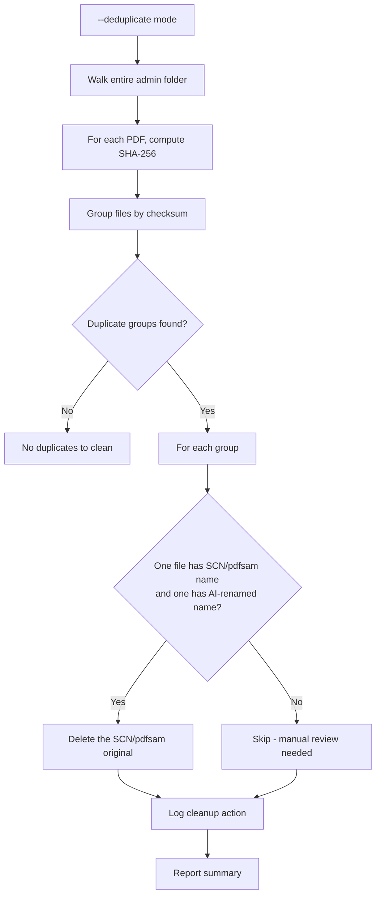

# Plan: Clean Up Duplicate Files Created by scan-admin --reroute

## Problem

Before the fix (commit `a3f1297`), `--scan-admin --reroute` copied files via `shutil.copy2()` to the new destination but **never deleted the original**. This created duplicates:
- Original still exists at old location: `30-Eric/20-Achats/SCN_0042.pdf`
- Copy exists at new location: `30-Eric/80-Sante/Facture_Orange_...pdf`

Now that the fix is in place (delete original after successful reroute), we need to clean up the existing duplicates.

## Solution: Re-run `--scan-admin --reroute`

The simplest and safest approach: **re-run `--scan-admin --reroute`**.

Since the fix now:
1. Preserves the person if file is already in a person folder
2. Deletes the original after successful routing

Re-running will find all SCN/pdfsam originals, re-classify them (same or better result), route to the correct destination (overwriting any existing duplicate harmlessly since same content), and **finally delete the original**.

### Step-by-step

```bash
# 1. Preview what will happen (simulation)
python pipeline.py --scan-admin --reroute --simulate

# 2. Verify the simulation shows the right destinations

# 3. Run the actual cleanup
python pipeline.py --scan-admin --reroute --report-dir logs/reports
```

### What will happen

| Before Fix | After Re-running |
|------------|------------------|
| `30-Eric/20-Achats/SCN_0042.pdf` (original) | ✅ Deleted |
| `30-Eric/80-Sante/Facture_Orange_2024-03.pdf` (copy) | ✅ Kept (overwritten harmlessly) |
| `20-Famille/90-Financier/Bank_statement.pdf` (old wrong reroute) | ⚠️ Not affected (not re-routed since no SCN/pdfsam at that path) |

### Edge case: old wrong reroutes

If a previous run (before person preservation) routed a file to the **wrong person's folder** (e.g., Famille instead of Eric), that old copy at the wrong location **will NOT be cleaned up** automatically because:
- The rerouted file no longer has an SCN/pdfsam name (it was renamed)
- scan-admin only finds files matching SCN/pdfsam patterns

**Manual cleanup needed**: Use the `--deduplicate` flag (option below) or search manually.

## Alternative: Add `--deduplicate` flag to scan-admin

If the re-run is not sufficient, we can add a `--deduplicate` mode that finds duplicates by **SHA-256 checksum** across the entire admin folder and removes originals.



This would be added to [`scan_admin_folder()`](pipeline.py:2550) as a new mode.

## Recommended Approach

1. **First**: Run `--scan-admin --reroute` with the fix — this will clean up most duplicates
2. **Then**: If any old duplicates at wrong person folders remain, run a manual find command:
   ```bash
   # Find duplicate PDFs by checksum
   find /Volumes/Administratif -name "*.pdf" -exec shasum -a 256 {} \; | sort | uniq -d -w 64
   ```
3. **Optionally**: Implement `--deduplicate` if manual cleanup is too tedious