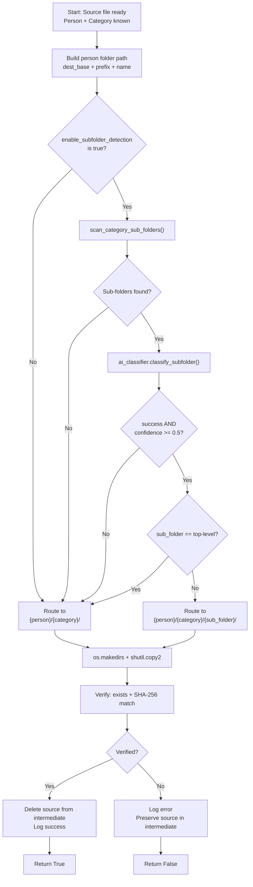

# Phase 2: AI Classification + Intelligent Renaming — Implementation Plan

> **Based on**: `DocumentOCRProcessingPipeline_Final.md`
> **Goal**: Add AI-powered document classification using Ollama + Qwen2.5 7B to identify the person, category, and suggest a meaningful filename for each document. After classification, route the searchable PDF to its destination (`{Person}/{Category}`) and rename it intelligently.
> **Phase 1 delivers**: OCR → searchable PDF in intermediate folder. Phase 2 extends this with AI classification → routing to final destination with intelligent naming.
>
> **Phase 2 Extension**: This plan adds **sub-folder detection** (Section 4.2, Section 8), which is not present in the master plan (`DocumentOCRProcessingPipeline_Final.md`). Sub-folder detection allows documents to be routed into existing sub-folders within a category directory (e.g., `30-Eric/20-Achats&Fournisseurs/30-FournisseursEnergie/`). This feature is optional and can be disabled via `pipeline.routing.enable_subfolder_detection: false`.

---

## 1. Overview of Changes

### What Phase 2 Adds

| Component | New/Modified | Description |
|-----------|-------------|-------------|
| [`src/ai_classifier.py`](#2-ai-classifier-srcai_classifierpy) | **New** | Ollama API integration for document classification |
| [`pipeline.py`](#4-updated-pipeline-flow) | **Modified** | Adds AI classification stage + file routing after OCR |
| [`src/config_manager.py`](#3-config-manager-updates) | **Modified** | Adds AI-related config properties + `person_categories_path` |
| [`config.yaml`](#config-file-changes) | **Modified** | Person categories path added |
| [`config.test.yaml`](#config-file-changes) | **Modified** | Person categories path added |
| [`tests/real_sources.yaml`](#52-testsreal_sourcesyaml--new-file) | **New** | Configuration file listing 10 real documents to use for validation |
| [`scripts/copy_real_test_data.py`](#53-scriptscopy_real_test_datapy--new-file) | **New** | Copies real documents (from `real_sources.yaml`) to the scanner folder with `__TEST_R__` prefix |

### What Phase 2 Does NOT Include (reserved for Phases 3–5)

- SQLite database (Phase 3)
- SHA-256 duplicate detection via index (Phase 3)
- APScheduler polling (Phase 3)
- Web UI (Phase 4)

### Assumptions

- **Phase 1 is fully implemented and validated**: OCR works, searchable PDFs are produced
- **Ollama is installed and running** with Qwen2.5 7B model pulled (`ollama pull qwen2.5:7b`)
- **`person_categories.yaml`** already exists at project root
- **NAS volumes** (`/Volumes/Public/`, `/Volumes/Administratif/`) are mounted and accessible

### Test Data Coverage Note

> **Eva (prefix 60-)** is not covered in the 12 synthetic test documents. Eva should be included in the real document tests (`tests/real_sources.yaml`) to ensure all 6 people in the hierarchy are validated. Consider adding at least one real document for Eva in the real test set.

---

## 2. AI Classifier — `src/ai_classifier.py`

### 2.1 Purpose

Takes OCR-extracted text from a document and uses Ollama (Qwen2.5 7B) to determine:
1. **Person** — which person this document belongs to (from `person_categories.yaml`)
2. **Category** — the most appropriate category for this person
3. **Suggested filename** — a meaningful human-readable filename (without extension) based on document content
4. **Confidence score** — how confident the model is about its classification (0.0–1.0)

### 2.2 Interface

```python
class AIClassifier:
    def __init__(self, config: ConfigManager):
        """
        Initialize the AI classifier.
        
        Args:
            config: Pipeline configuration (reads ai.* and person_categories.yaml).
        """
        ...
    
    def classify(self, ocr_text: str, filename: str, page_count: int) -> dict:
        """
        Classify a document based on its OCR text.
        
        Args:
            ocr_text: Full text extracted by OCR engine.
            filename: Original filename (for context).
            page_count: Number of pages in the document.
        
        Returns:
            dict with:
                - success: bool
                - person: str (e.g. "Eric")
                - category: str (e.g. "20-Achats&Fournisseurs")
                - suggested_filename: str (e.g. "Facture_Orange_2024-03")
                - confidence: float (0.0–1.0)
                - reasoning: str (brief explanation from AI)
                - error: str (if failed)
        """
        ...

    def classify_subfolder(
        self,
        ocr_text: str,
        person: str,
        category: str,
        sub_folders: list[str],
    ) -> dict:
        """
        Determine if a document should go into an existing sub-folder
        or stay at the top level of the category.

        Args:
            ocr_text: Full OCR-extracted text.
            person: Already-classified person (e.g., 'Eric').
            category: Already-classified category (e.g., '20-Achats&Fournisseurs').
            sub_folders: List of existing sub-folder names (e.g.,
                ['30-FournisseursEnergie', '40-FournisseursInternet']).

        Returns:
            dict with:
                - success: bool
                - sub_folder: str or None ('top-level' or a sub-folder name)
                - confidence: float (0.0–1.0)
                - reasoning: str (brief explanation)
                - error: str (if failed)
        """
        ...

    def _build_prompt(self, ocr_text: str, filename: str, page_count: int) -> str:
        """Construct the prompt for the LLM."""
        ...

    def _build_subfolder_prompt(
        self,
        ocr_text: str,
        person: str,
        category: str,
        sub_folders: list[str],
    ) -> str:
        """Construct the prompt for sub-folder classification."""
        ...

    def _call_ollama(self, prompt: str, max_tokens: int = 500) -> dict:
        """Make the API call to Ollama and parse the JSON response."""
        ...

    def _parse_response(self, raw_response: str) -> dict:
        """Parse the JSON response from the LLM."""
        ...

    def _sanitize_filename(self, filename: str) -> str:
        """
        Sanitize a suggested filename:
        - Replace spaces with underscores
        - Replace special characters with underscores
        - Limit length to 100 characters
        - Remove any path separators
        """
        ...
```

### 2.3 Primary Classification Prompt Template

The prompt is the core of the classifier. It must be carefully designed to produce consistent, parseable JSON output.

```
You are a document classification assistant for an administrative document management system.

Document details:
- Filename: {filename}
- Page count: {page_count}
- OCR Text:
---
{ocr_text}
---

Available people and their categories (only 2 levels: Person > Category):
{person_category_hierarchy}

Tasks:
1. Identify which person this document belongs to. Choose ONLY from the list above.
2. Identify the most appropriate category for this person. Choose ONLY from the categories listed for that person.
3. Suggest a meaningful filename (no extension, no path) based on document content. Examples:
   - "Facture_Orange_2024-03" (not "SCN_0042")
   - "Convention_Stage_Loic_Fev_2025"
   - "Releve_Bancaire_Compte_Conjoint_2024-06"
   - Use underscores, not spaces
   - Include date or period if present
   - Maximum 100 characters
4. Provide a confidence score between 0.0 and 1.0.
5. Provide a one-sentence reasoning for your choices.

Return ONLY valid JSON with no markdown formatting, no code fences, no extra text:
{
  "person": "Eric",
  "category": "20-Achats&Fournisseurs",
  "suggested_filename": "Facture_Orange_2024-03",
  "confidence": 0.95,
  "reasoning": "The document is an Orange internet invoice addressed to Eric at his home address."
}
```

### 2.4 Sub-Folder Classification Prompt Template

A secondary, lightweight prompt used when sub-folders already exist in the destination category folder:

```
You are a document filing assistant. A document has already been classified
as belonging to {person} > {category}.

Document OCR Text:
---
{ocr_text}
---

The category "{category}" already contains these sub-folders:
{sub_folder_list}

Task: Decide whether this document should be filed into one of the
existing sub-folders, or stay at the top level of "{category}".

- If the document's content clearly matches a sub-folder, choose that name.
- If no sub-folder is a good fit, choose "top-level".
- Provide a confidence score between 0.0 and 1.0.

Return ONLY valid JSON with no markdown, no code fences:
{
  "sub_folder": "30-FournisseursEnergie",
  "confidence": 0.85,
  "reasoning": "The document is an Engie gas bill, matching the FournisseursEnergie sub-folder."
}
```

### 2.5 Person/Category Hierarchy Format

The `_build_prompt` method reads [`person_categories.yaml`](person_categories.yaml) and formats it into a readable text block:

```
Famille (prefix 20-): 10-DocumentsOfficiels, 20-Achats&Fournisseurs, 30-SousTraitance, 40-ActiviteProf, 50-Projets, 60-Loisirs, 70-Digital, 90-Financier
Eric (prefix 30-): 10-DocumentsOfficiels, 20-Achats&Fournisseurs, 40-ActiviteProf, 50-Projets, 60-Loisirs, 70-Digital, 80-Sante, 90-Financier
Sophie (prefix 40-): ...
...
```

### 2.6 Ollama API Call

- **Endpoint**: `http://localhost:11434/api/generate`
- **Method**: POST
- **Request body** (primary classification):
  ```json
  {
    "model": "qwen2.5:7b",
    "prompt": "...",
    "stream": false,
    "temperature": 0.1,
    "max_tokens": 500
  }
  ```
- **Request body** (sub-folder classification — simpler, fewer tokens):
  ```json
  {
    "model": "qwen2.5:7b",
    "prompt": "...",
    "stream": false,
    "temperature": 0.1,
    "max_tokens": 200
  }
  ```
- **Response parsing**: Extract `response` field, parse as JSON
- **Error handling**:
  - Connection refused → return `{"success": false, "error": "Ollama server not reachable"}`
  - Timeout → return `{"success": false, "error": "Ollama request timed out"}`
  - Invalid JSON response → attempt to extract JSON from response body using regex
  - All errors are logged and the file is flagged for manual review

### 2.7 Response Parsing & Validation

#### Primary Classification Validation

After receiving the raw response from Ollama:

1. **Strip markdown fences** if present (```json ... ```)
2. **Parse JSON** with `json.loads()`
3. **Validate required fields**: `person`, `category`, `suggested_filename`, `confidence`
4. **Validate person** exists in [`person_categories.yaml`](person_categories.yaml)
5. **Validate category** is valid for that person
6. **Validate confidence** is a float between 0.0 and 1.0
7. **Sanitize `suggested_filename`**:
   - Strip file extension if accidentally included
   - Replace spaces → underscores
   - Replace `/ \ : * ? " < > |` → underscores
   - Collapse multiple underscores → single underscore
   - Strip leading/trailing underscores, dots, spaces
   - Truncate to 100 characters

If validation fails at any point → log warning, return `success: false` with descriptive error.

#### Sub-Folder Classification Validation

1. Parse JSON from response
2. Check `sub_folder` is either `"top-level"` OR one of the names in the `sub_folders` list
3. Check confidence is float between 0.0–1.0
4. If invalid → return `success: false`, fall back to top-level in category

### 2.8 Confidence Threshold

- **Primary classification threshold**: `0.70` (configurable via `pipeline.ai.confidence_threshold`)
  - Above threshold: Document proceeds to routing (copy to destination)
  - Below threshold: Document flagged for manual review; searchable PDF is **left in the intermediate folder** (`00-ScansNonTries`), NOT routed
  - Error / failed classification: Same as below threshold — file left in intermediate folder
- **Sub-folder classification threshold**: `0.50` (configurable via `pipeline.routing.subfolder_confidence_threshold`)
  - Above threshold: Document routed into the selected sub-folder
  - Below threshold: Document routed to top level of the category folder
- **Note**: The sub-folder threshold (0.50) is lower than the primary threshold (0.70) because sub-folder classification is a simpler, more deterministic decision (choose an existing sub-folder name or "top-level"). A lower threshold reduces unnecessary top-level fallbacks when the AI is reasonably confident.

### 2.9 Error Handling Strategy

| Scenario | Behavior |
|----------|----------|
| Ollama not running | Log error, return `success: false`. File stays in intermediate folder. |
| Ollama returns gibberish | Log warning, attempt regex extraction. If still invalid → `success: false`. |
| Person not in hierarchy | Log error, return `success: false`. File stays in intermediate folder. |
| Category not valid for person | Log error, attempt fuzzy match. If no match → `success: false`. |
| JSON parse error | Log warning, try to extract JSON with regex. If fails → `success: false`. |
| Timeout (>30s) | Log error, return `success: false`. File stays in intermediate folder. |
| Sub-folder AI call fails | Log warning, fall back to top-level, proceed. |
| Sub-folder AI returns invalid name | Log error, fall back to top-level, proceed. |
| Sub-folder confidence < 0.5 | Log debug, fall back to top-level, proceed. |

### 2.10 `classify_subfolder()` — Design Notes

The `classify_subfolder()` method differs from `classify()` in the following ways:

- **No `page_count` parameter**: Sub-folder classification does not need page count information. The decision is purely based on document content vs. existing sub-folder names.
- **Simpler prompt**: Uses a lighter-weight prompt template (Section 2.4) with fewer tokens and no hierarchy context.
- **Lower `max_tokens`**: Uses 200 tokens instead of 500, since the response is just a sub-folder name or "top-level".
- **Validation**: Checks that the returned `sub_folder` name is either `"top-level"` or one of the provided `sub_folders` list entries. This is a strict whitelist validation.
- **Fallback behavior**: If the AI call fails, the method returns `success: false` with `sub_folder: "top-level"`, allowing the pipeline to proceed with top-level routing without blocking.

---

## 3. Config Manager Updates

### 3.1 New Properties for [`src/config_manager.py`](src/config_manager.py)

Add the following properties to the existing [`ConfigManager`](src/config_manager.py:10) class:

```python
@property
def ai_engine(self) -> str:
    """AI engine name (e.g. 'ollama')."""
    return self.get("pipeline.ai.engine", "ollama")

@property
def ai_model(self) -> str:
    """Ollama model name (e.g. 'qwen2.5:7b')."""
    return self.get("pipeline.ai.model", "qwen2.5:7b")

@property
def ai_temperature(self) -> float:
    """Temperature for LLM sampling (0.0–1.0)."""
    return self.get("pipeline.ai.temperature", 0.1)

@property
def ai_max_tokens(self) -> int:
    """Maximum tokens for LLM response."""
    return self.get("pipeline.ai.max_tokens", 500)

@property
def ai_confidence_threshold(self) -> float:
    """Minimum confidence for auto-routing (0.0–1.0)."""
    return self.get("pipeline.ai.confidence_threshold", 0.7)

@property
def person_categories_path(self) -> str:
    """Path to the person/categories YAML file."""
    return self.get("pipeline.person_categories_path", "person_categories.yaml")

@property
def rename_prefix(self) -> str:
    """
    Prefix for filenames that should be renamed by AI.
    Only files whose original name starts with this prefix will be renamed.
    Empty string "" means rename ALL files.
    Default: "SCN" (files like SCN_0042.pdf from the scanner).
    """
    return self.get("pipeline.rename_prefix", "SCN")

@property
def enable_subfolder_detection(self) -> bool:
    """Whether to scan for and route into existing sub-folders in category directories."""
    return self.get("pipeline.routing.enable_subfolder_detection", True)

@property
def subfolder_confidence_threshold(self) -> float:
    """Minimum confidence for AI sub-folder classification (0.0–1.0)."""
    return self.get("pipeline.routing.subfolder_confidence_threshold", 0.5)
```

### 3.2 Person Categories Loader

Also add a method to load the person/categories hierarchy:

```python
def load_person_categories(self) -> dict:
    """
    Load the person/category hierarchy from person_categories.yaml.
    
    Returns:
        dict with:
            - people: list of {name, prefix, categories: [...]}
    """
    path = self.person_categories_path
    if not os.path.isfile(path):
        raise FileNotFoundError(f"Person categories file not found: {path}")
    with open(path, "r", encoding="utf-8") as f:
        data = yaml.safe_load(f)
    return data
```

---

## 4. Updated Pipeline Flow

### 4.1 New Flow in [`pipeline.py`](pipeline.py)

The existing `process_all()` function is extended to add AI classification and file routing after successful OCR.

**New high-level flow** (modified section in [`process_all()`](pipeline.py:49)):

```
For each PDF file:
  1. Compute SHA-256 checksum (before processing)
  2. Run OCR → searchable PDF in intermediate folder
  3. Verify output exists + checksum integrity
  4. ✅ NEW: Run AI classification on OCR text
  5. ✅ NEW: Determine final filename:
       a. Check if original filename starts with rename_prefix (configurable, default "SCN")
       b. In test mode (when `test_mode.enabled` is true): strip the test prefix using regex pattern
          `__TEST_[SR]\d{2}__` before checking `rename_prefix`
          (e.g., `__TEST_S01__SCN_0042.pdf` → `SCN_0042.pdf`, `__TEST_R03__Devis_2024.pdf` → `Devis_2024.pdf`)
       c. If yes (e.g. SCN_0042.pdf) → use AI-suggested filename
       d. If no (e.g. Devis_2024.pdf) → keep original filename
       e. If rename_prefix is "" → always use AI-suggested filename
  6. ✅ NEW: If confidence >= threshold:
       a. Sanitize final filename (spaces/special chars → underscores, limit 100 chars)
       b. ✅ NEW: Sub-folder detection (see Section 4.5)
       c. Build destination path: {Person}/{Category}/{final_filename}.pdf
          (or {Person}/{Category}/{SubFolder}/{final_filename}.pdf if sub-folder detected)
       d. Create destination directories if needed
       e. Copy searchable PDF to destination path
       f. Verify destination file exists + checksum matches
       g. Delete searchable PDF from intermediate folder (safe deletion)
       h. Log full lifecycle: original → searchable → destination
  7. ✅ NEW: If confidence < threshold:
       a. Log warning
       b. Leave searchable PDF in intermediate folder for manual review
       c. Do NOT delete raw scan yet
       d. (Raw scan deletion still governed by OCR success)
  8. Delete raw scan from scanner folder (only after OCR success + destination verified)
```

### 4.2 New Functions in `pipeline.py`

```python
def load_person_hierarchy(config: ConfigManager) -> dict:
    """Load and return the person/category hierarchy from YAML."""
    ...

def build_destination_path(
    config: ConfigManager,
    person: str,
    category: str,
    filename: str
) -> str:
    """
    Build the full destination path.
    Example: /Volumes/Administratif/30-Eric/20-Achats&Fournisseurs/Facture_Orange_2024-03.pdf
    
    Uses the prefix from person_categories.yaml to construct the person folder name
    (e.g., "Eric" + prefix "30-" → "30-Eric").
    """
    ...

def scan_category_sub_folders(
    person_folder_path: str,
    category: str,
) -> list[str]:
    """
    Scan a category directory for immediate sub-folders.
    
    Args:
        person_folder_path: Full path to the person's folder (e.g.,
            '/Volumes/Administratif/30-Eric').
        category: Category name (e.g., '20-Achats&Fournisseurs').
    
    Returns:
        Sorted list of sub-folder names found.
        Returns empty list if category dir doesn't exist or has no sub-folders.
        Hidden folders (starting with '.') are excluded.
    """
    category_path = os.path.join(person_folder_path, category)
    if not os.path.isdir(category_path):
        return []
    return sorted([
        entry.name for entry in os.scandir(category_path)
        if entry.is_dir() and not entry.name.startswith(".")
    ])

def route_to_destination(
    source_path: str,
    dest_base: str,
    person: str,
    category: str,
    filename: str,
    config: ConfigManager,
    ai_classifier: AIClassifier | None = None,
    ocr_text: str = "",
) -> bool:
    """
    Route a file to its final destination, optionally detecting sub-folders.
    
    Steps:
    1. Build person folder path from dest_base + prefix + person name
    2. If enable_subfolder_detection is true:
       a. Scan category directory for existing sub-folders
       b. If sub-folders found → call ai_classifier.classify_subfolder()
       c. If valid sub-folder chosen → append to destination path
    3. Ensure destination directory exists (os.makedirs)
    4. Copy file (shutil.copy2)
    5. Verify destination exists
    6. Compute SHA-256 of destination
    7. Log result
    
    Returns:
        True if routing succeeded and file is verified
    """
    # Build person folder path using prefix
    # Use ConfigManager.load_person_categories() to read person_categories.yaml
    hierarchy = config.load_person_categories()
    prefix = ""
    for p in hierarchy["people"]:
        if p["name"] == person:
            prefix = p["prefix"]
            break
    person_folder = f"{prefix}{person}"
    category_path = os.path.join(dest_base, person_folder, category)
    
    # Sub-folder detection
    dest_path = category_path
    if config.enable_subfolder_detection and ai_classifier is not None:
        sub_folders = scan_category_sub_folders(
            os.path.join(dest_base, person_folder), category
        )
        if sub_folders:
            sub_result = ai_classifier.classify_subfolder(
                ocr_text, person, category, sub_folders
            )
            if (sub_result.get("success")
                    and sub_result.get("sub_folder")
                    and sub_result["sub_folder"] != "top-level"
                    and sub_result.get("confidence", 0) >= config.subfolder_confidence_threshold):
                dest_path = os.path.join(category_path, sub_result["sub_folder"])
                logging.getLogger("pipeline").info(
                    "Sub-folder detected: %s/%s", category, sub_result["sub_folder"]
                )
    
    # Ensure destination directory exists
    os.makedirs(dest_path, exist_ok=True)
    full_dest = os.path.join(dest_path, filename)
    
    # Copy file
    shutil.copy2(source_path, full_dest)
    
    # Verify destination exists and checksum matches
    if not os.path.isfile(full_dest):
        logging.getLogger("pipeline").error("Destination file not found after copy: %s", full_dest)
        return False
    
    # Checksum verification
    src_checksum = compute_sha256(source_path)
    dst_checksum = compute_sha256(full_dest)
    if src_checksum != dst_checksum:
        logging.getLogger("pipeline").error(
            "Checksum mismatch for %s → %s", source_path, full_dest
        )
        return False
    
    logging.getLogger("pipeline").info(
        "Successfully routed to: %s (checksum verified)", full_dest
    )
    return True
```

### 4.3 Routing Decision Flow



### 4.4 CLI Changes

No new CLI arguments for Phase 2. The existing `--process` command now includes AI classification automatically. However, if Ollama is not available, the pipeline should gracefully degrade:

- **Ollama not reachable**: Log error, skip classification, leave files in intermediate folder, continue processing remaining files
- **Classification error on one file**: Log error, skip routing for that file, continue with next file
- **Sub-folder AI call fails**: Log warning, fall back to top-level routing, continue

### 4.5 Safe Deletion Refinements

The safe deletion protocol from Phase 1 is extended:

| Stage | Location | Deleted When |
|-------|----------|-------------|
| **0** | Scanner folder (raw scan) | After OCR success **AND** (routing success OR confidence < threshold — file stays for review) |
| **1** | Intermediate folder (searchable PDF) | Only after destination copy is **verified** by checksum |
| **2** | Destination folder (final) | Never deleted |

**Important change**: If confidence < threshold, the raw scan is STILL deleted (OCR succeeded), but the searchable PDF remains in the intermediate folder for manual review. This prevents the scanner folder from filling up with already-OCR'd files.

---

## 5. File-by-File Specification

### 5.1 [`src/ai_classifier.py`](src/ai_classifier.py) — NEW FILE

**Dependencies**:
- `requests` (HTTP calls to Ollama)
- `json`, `re`, `logging`
- `src.config_manager.ConfigManager`

**Structure**:

```
src/ai_classifier.py
├── imports
├── logger
├── class AIClassifier
│   ├── __init__(self, config: ConfigManager)
│   │   └── Load config, load person_categories.yaml, build hierarchy string
│   ├── classify(self, ocr_text, filename, page_count) -> dict
│   │   ├── Build prompt via _build_prompt()
│   │   ├── Call Ollama via _call_ollama()
│   │   ├── Parse response via _parse_response()
│   │   └── Validate and return result
│   ├── classify_subfolder(self, ocr_text, person, category, sub_folders) -> dict
│   │   ├── Build prompt via _build_subfolder_prompt()
│   │   ├── Call Ollama via _call_ollama(max_tokens=200)
│   │   ├── Parse response
│   │   └── Validate sub_folder name against sub_folders list
│   ├── _build_prompt(self, ocr_text, filename, page_count) -> str
│   │   └── Format the primary prompt template with document details + hierarchy
│   ├── _build_subfolder_prompt(self, ocr_text, person, category, sub_folders) -> str
│   │   └── Format the sub-folder prompt template with document + sub-folder list
│   ├── _call_ollama(self, prompt, max_tokens=500) -> str
│   │   ├── POST to http://localhost:11434/api/generate
│   │   ├── Handle connection errors, timeouts
│   │   └── Return raw response text
│   ├── _parse_response(self, raw_response) -> dict
│   │   ├── Strip markdown fences
│   │   ├── Parse JSON
│   │   ├── Validate fields
│   │   └── Sanitize suggested_filename via _sanitize_filename()
│   ├── _validate_person_category(self, person, category) -> bool
│   │   └── Check person + category against loaded hierarchy
│   ├── _sanitize_filename(self, filename) -> str
│   │   └── Clean up suggested filename
│   └── _format_hierarchy(self, data) -> str
│       └── Convert person_categories dict to readable text
```

### 5.2 [`pipeline.py`](pipeline.py) — MODIFIED

**Changes**:
1. Add `from src.ai_classifier import AIClassifier` import
2. Add `import shutil` for file operations
3. Add helper functions: `load_person_hierarchy()`, `build_destination_path()`, `scan_category_sub_folders()`, `route_to_destination()`
4. Modify `process_all()` to add AI classification and routing after OCR step
5. Update logging messages

### 5.3 [`src/config_manager.py`](src/config_manager.py) — MODIFIED

**Changes**: Add 9 new properties (see [Section 3.1](#31-new-properties-in-srcconfig_managerpy)) and `load_person_categories()` method.

### 5.4 [`config.yaml`](config.yaml) & [`config.test.yaml`](config.test.yaml) — MODIFIED

**Changes**: Add `person_categories_path`, `rename_prefix`, and `routing:` section under `pipeline`:

```yaml
pipeline:
  # ... existing config ...
  person_categories_path: "person_categories.yaml"  # NEW
  rename_prefix: "SCN"                                # NEW — only rename files starting with this prefix

  routing:                                            # NEW section
    enable_subfolder_detection: true                  # Toggle: scan for sub-folders in category dirs
    subfolder_confidence_threshold: 0.5               # Min confidence for sub-folder decision

  # ... rest of config ...
```

The `rename_prefix` controls which files get renamed by AI:
- `"SCN"` (default): only files starting with `SCN` (e.g., `SCN_0042.pdf`) will be renamed
- `""` (empty string): ALL files will be renamed (opt-in to rename everything)
- Any other string: files starting with that string will be renamed
- **In test mode** (when `test_mode.enabled` is true): The test prefix is stripped using regex pattern `__TEST_[SR]\d{2}__` before checking `rename_prefix`. This handles both synthetic (`__TEST_S01__`) and real (`__TEST_R03__`) test file formats. The stripping is only applied when `test_mode.enabled` is true, so production files are never affected.

### 5.5 [`tests/real_sources.yaml`](tests/real_sources.yaml) — NEW FILE

**Purpose**: Configuration file listing real documents to copy for testing with `__TEST_R__` prefix. This enables testing the AI classifier and pipeline against real-world scanned documents (variable quality, realistic OCR challenges), not just clean synthetic PDFs.

**Format**:

```yaml
# List of real documents to copy for testing
# Source paths are on the NAS, destination is the scanner folder
# Each file will be copied with __TEST_R__ prefix
# use_scn_prefix: true  → copied as __TEST_R01__SCN_{original_name} (will be renamed by AI)
# use_scn_prefix: false → copied as __TEST_R01__{original_name} (keeps original name)
real_documents:
  - source: "/Volumes/Administratif/30-Eric/10-DocumentsOfficiels/Passport_2023.pdf"
    expected_person: "Eric"
    expected_category: "10-DocumentsOfficiels"
    use_scn_prefix: true
    notes: "Clean passport scan — tests rename on SCN prefix"
  - source: "/Volumes/Administratif/40-Sophie/20-Achats&Fournisseurs/Amazon_commande_2024.pdf"
    expected_person: "Sophie"
    expected_category: "20-Achats&Fournisseurs"
    use_scn_prefix: false
    notes: "Online order receipt — tests no-rename on non-SCN name"
  # ... add 8 more real documents (mix of use_scn_prefix: true/false)
```

**Selection criteria for the 10 real documents** (from the master plan):
- 3 documents from different people (Eric, Sophie, Famille, etc.)
- 3 documents with different quality levels (clean, slightly skewed, low contrast)
- 2 multi-page documents (tests OCR across pages)
- 1 document that is mostly handwritten (tough OCR challenge)
- 1 document mixing French and English
- **rename_prefix coverage**: Mix of `use_scn_prefix: true` and `false` entries (e.g., 5 SCN + 5 non-SCN) to test both rename paths

**Safety**: The file only lists source paths. It NEVER moves or modifies the originals. The copy script creates duplicates with the `__TEST_R__` prefix.

### 5.6 [`scripts/copy_real_test_data.py`](scripts/copy_real_test_data.py) — NEW FILE

**Purpose**: Reads `tests/real_sources.yaml`, copies each listed document to `/Volumes/Public/-ScansImprimante/` with the `__TEST_R__{NN}__` prefix, and records the mapping in a JSON manifest for traceability.

**Interface**:

```bash
python scripts/copy_real_test_data.py                          # Copy all 10 real docs
python scripts/copy_real_test_data.py --config tests/real_sources.yaml  # Custom source list
python scripts/copy_real_test_data.py --dry-run                 # Show what would be copied
python scripts/copy_real_test_data.py --manifest tests/test_data/REAL/manifest.json  # Custom manifest path
```

**Behavior**:
1. Reads `tests/real_sources.yaml`
2. For each entry, checks `use_scn_prefix`:
   - `true` → copies as `/Volumes/Public/-ScansImprimante/__TEST_R{NN:02d}__SCN_{original_name}` — tests SCN rename logic
   - `false` (default) → copies as `/Volumes/Public/-ScansImprimante/__TEST_R{NN:02d}__{original_name}` — tests no-rename behavior
3. Creates `tests/test_data/REAL/manifest.json` with the mapping (source → copy name)
4. Outputs a summary of what was copied

**Safety checks**:
- Verifies source file exists before copying (skip with warning if not found)
- Refuses to overwrite existing files in scanner folder (unless `--force` flag is passed)
- Never modifies or touches the original source file

---

## 6. Design Decisions

| Decision | Choice | Rationale |
|----------|--------|-----------|
| **Ollama HTTP API** | `requests` library | Simple, synchronous, widely available. No need for async in Phase 2. |
| **Temperature** | 0.1 (very low) | Classification needs consistency, not creativity. Lower temperature = more deterministic output. |
| **Max tokens (primary)** | 500 | JSON response is typically ~150-200 tokens. 500 gives comfortable margin. |
| **Max tokens (sub-folder)** | 200 | Sub-folder classification is simpler — just name or "top-level". |
| **Prompt format** | Detailed with examples | Few-shot examples improve JSON compliance and classification quality. |
| **JSON parsing** | `json.loads` + regex fallback | Ollama sometimes wraps JSON in markdown fences. Regex handles edge cases. |
| **Filename sanitization** | Replace special chars, truncate at 100 | Prevents filesystem issues (illegal chars on macOS/Linux). 100 chars is descriptive enough. |
| **Graceful degradation** | Skip file, continue processing | One failed classification should not block other documents. |
| **File routing** | `shutil.copy2` (copy, not move) | Copy + verify + delete original is safer than move (preserves original if copy fails). |
| **Person folder naming** | `{prefix}{name}` (e.g., `30-Eric`) | Uses prefix from `person_categories.yaml` for consistent sorting. |
| **Rename prefix check** | Configurable `rename_prefix` (default `"SCN"`) | Scanner produces `SCN_xxxx.pdf` files. Already-named documents should not be renamed. Empty string = rename all. |
| **Sub-folder detection** | Dynamic scan at routing time | No YAML changes needed. Sub-folders are discovered automatically. |
| **Sub-folder confidence threshold** | 0.5 (lower than primary 0.7) | Sub-folder choice is a simpler decision. Lower threshold reduces false top-level fallbacks. |
| **Sub-folder depth** | 1 level only | Avoids complexity of recursive nesting. Users can organize within 1 level. |

---

## 7. Destination Path Decision Schema

```
Inputs:
  - person (str):          "Eric"
  - category (str):        "20-Achats&Fournisseurs"
  - prefix (str):          "30-"
  - sub_folder (str|None): "40-FournisseursInternet" or None

Logic:
  base = f"{dest_base}/{prefix}{person}/{category}"
  if sub_folder and sub_folder != "top-level":
      dest = f"{base}/{sub_folder}/{filename}"
  else:
      dest = f"{base}/{filename}"
```

---

## 8. Edge Cases — Sub-Folder Routing

| Scenario | Behavior |
|----------|----------|
| **No sub-folders exist** | Behaves exactly as base Phase 2 — route to `{person}/{category}/` |
| **Sub-folder AI call fails** (Ollama down) | Log warning, fall back to top-level, proceed |
| **Sub-folder AI returns invalid name** | Log error, fall back to top-level, proceed |
| **Sub-folder confidence < 0.5** | Log debug, fall back to top-level, proceed |
| **Sub-folder deleted between scan and copy** | `os.makedirs` creates it (harmless); file lands where expected |
| **Multiple sub-folder levels exist** | Only 1 level is scanned (no recursion). File goes to first matching level. |
| **Hidden sub-folders exist** (`.tags`, `.git`) | Explicitly excluded from scan |
| **Category directory doesn't exist yet** | `scan_category_sub_folders()` returns `[]` → top-level route |
| **Sub-folder name contains special characters** | Already exists on filesystem, so it's valid. File copy will work. |
| **enable_subfolder_detection: false** (config) | Sub-folder scan skipped entirely. Strict base Phase 2 behavior. |

---

## 9. Dependencies

Add to [`requirements.txt`](requirements.txt):

```
requests>=2.28.0          # HTTP client for Ollama API
```

The existing dependencies remain (with `requests` added):
```
pytesseract>=0.3.10
PyMuPDF>=1.23.0
Pillow>=10.0.0
PyYAML>=6.0
requests>=2.28.0          # NEW — HTTP client for Ollama API
```

---

## 10. Pre-Implementation Checklist

Before Code mode starts, ensure:

- [ ] **Ollama installed**: Run `ollama --version`
- [ ] **Qwen2.5 7B model pulled**: Run `ollama pull qwen2.5:7b`
- [ ] **Ollama is running**: Run `curl http://localhost:11434/api/tags` — should return JSON list of models
- [ ] **Python dependencies installed**: `pip install requests` (or `pip install -r requirements.txt` with updated file)
- [ ] **Phase 1 validated**: OCR pipeline works correctly with test data
- [ ] **NAS volumes mounted**: `/Volumes/Public/` and `/Volumes/Administratif/`
- [ ] **For real document testing**: `tests/real_sources.yaml` filled in with 10 real document paths
- [ ] **For real document testing**: Source files listed in `real_sources.yaml` actually exist on the NAS
- [ ] **For sub-folder testing**: Test sub-folders created in destination directories (see Section 12.3 pre-test setup)

---

## 11. Order of Implementation

1. **Update `requirements.txt`** — Add `requests`
2. **Update `src/config_manager.py`** — Add AI-related properties + `load_person_categories()` + routing properties
3. **Create `src/ai_classifier.py`** — The core new module (including `classify_subfolder()`)
4. **Update `config.yaml`** and **`config.test.yaml`** — Add `person_categories_path`, `rename_prefix`, `routing:` section
5. **Update `pipeline.py`** — Integrate AI classification + file routing + sub-folder detection
6. **Create `tests/real_sources.yaml`** — Configure 10 real document paths (user fills in actual paths)
7. **Create `scripts/copy_real_test_data.py`** — Script to copy real docs with `__TEST_R__` prefix
8. **Update `scripts/generate_test_data.py`** — Modify naming: 5 files with `SCN` base name and 4 files with descriptive base name to test `rename_prefix` logic; **add S11 + S12 for sub-folder routing validation**
9. **Update `scripts/cleanup_test_data.sh`** — Add cleanup of test sub-folders created for sub-folder validation (delete `30-FournisseursEnergie`, `40-FournisseursInternet` from Eric and Famille categories)
10. **Step 1 validation: synthetic test data (12 documents)** — Validate classification accuracy + rename_prefix behavior + sub-folder routing with known ground truth
11. **Step 2 validation: real test data** — Validate classification robustness with real-world documents

---

## 12. Phase 2 Validation Procedure

The validation is split into **two tracks**: one for synthetic documents (known ground truth) and one for real documents (real-world quality).

### 12.1 Step 1 — Synthetic Document Validation (Known Ground Truth + Sub-Folder Routing)

**Pre-Test Setup** — Create test sub-folders that will trigger sub-folder detection:

```bash
# Create sub-folders inside Eric's Achats category
mkdir -p "/Volumes/Administratif/30-Eric/20-Achats&Fournisseurs/30-FournisseursEnergie"
mkdir -p "/Volumes/Administratif/30-Eric/20-Achats&Fournisseurs/40-FournisseursInternet"

# Create sub-folders inside Famille's Achats category
mkdir -p "/Volumes/Administratif/20-Famille/20-Achats&Fournisseurs/30-FournisseursEnergie"
```

**Validation Run**:

```bash
# Ensure Ollama is running
ollama serve  # (if not already running)

# Generate synthetic PDFs (12 docs: S01-S10 + S11-S12 for sub-folder tests) and copy to scanner folder
python scripts/generate_test_data.py
cp tests/test_data/SYNTHETIC/__TEST_S*.pdf /Volumes/Public/-ScansImprimante/

# Run pipeline with test config
python pipeline.py --config config.test.yaml --process

# Check logs for AI classification output per file
tail -n 80 logs/pipeline.test.log
```

After the pipeline completes, verify:

1. **All 12 files processed**: Check the success count in logs (S01-S12)
2. **Classification accuracy**: Compare each file's AI output against the [Classification Accuracy Table](#classification-accuracy-table-synthetic) below
3. **Correct routing**: Each file is in its expected destination folder
4. **Sub-folder routing** (critical):
   - **S11** (Eric, 20-Achats&Fournisseurs, top-level) → must land directly in `30-Eric/20-Achats&Fournisseurs/`, NOT in a sub-folder
   - **S12** (Famille, 20-Achats&Fournisseurs, 30-FournisseursEnergie) → must land in `20-Famille/20-Achats&Fournisseurs/30-FournisseursEnergie/`
   - Existing files S01-S10 must NOT be affected by sub-folder detection (they route to their correct Person/Category as before)
5. **rename_prefix behavior** (critical):
   - Files S01, S02, S03, S07, S08, S10 (base name starts with `SCN`) → **must be renamed** to AI-suggested name
   - Files S04, S05, S06, S09 (base name starts with descriptive text) → **must keep original name** (e.g., `Passeport_Sophie_2025.pdf`)
   - S11, S12 (base name starts with `SCN`) → **must be renamed** to AI-suggested name
   - The test prefix `__TEST_Sxx__` is stripped before checking `rename_prefix`
6. **Intelligent filenames**: Renamed files have meaningful names (e.g., `Facture_Orange_2024-03.pdf`)
7. **Intermediate folder**: Only files with confidence < 0.70 remain in `00-ScansNonTries`
8. **Scanner folder**: All raw scans deleted

**Minimum acceptance**: At least **9 out of 12** synthetic documents must be classified to the **correct person**. All `SCN`-prefixed files must be renamed, and all non-`SCN` files must keep their original name. Sub-folder routing must work for S11 (top-level) and S12 (sub-folder).

**Sub-Folder Validation Criteria**:

| # | Criterion | Pass/Fail |
|---|-----------|-----------|
| SF1 | S12 (clear sub-folder match) → routed into `30-FournisseursEnergie` sub-folder | |
| SF2 | S11 (no sub-folder match) → stays at top level of `20-Achats&Fournisseurs` | |
| SF3 | Sub-folder AI confidence < 0.5 → falls back to top level (can be tested by temporarily setting a very high threshold) | |
| SF4 | `enable_subfolder_detection: false` → all files go to top level (no sub-folder routing) | |
| SF5 | Category directory doesn't exist yet → file created at top level (no sub-folder attempt) | |
| SF6 | Sub-folder AI call fails (Ollama down) → file routed to top level gracefully | |

### 12.2 Step 2 — Real Document Validation (Real-World Quality)

Before running this step, you must fill in [`tests/real_sources.yaml`](tests/real_sources.yaml) with paths to 10 real documents on your NAS (see [Section 5.5](#55-testsreal_sourcesyaml--new-file) for selection criteria).

```bash
# Copy 10 real documents to scanner folder with __TEST_R__ prefix
python scripts/copy_real_test_data.py

# Run pipeline with test config
python pipeline.py --config config.test.yaml --process

# Check logs for AI classification output on real documents
tail -n 50 logs/pipeline.test.log

# Check each destination folder — verify files arrived with correct person/category
ls /Volumes/Administratif/30-Eric/20-Achats&Fournisseurs/
ls /Volumes/Administratif/*/*/
```

After the pipeline completes, manually verify for each document:

1. **Was it OCR'd successfully?** Open the searchable PDF and check text selectability
2. **Was the person correctly identified?** Check the destination folder path
3. **Was the category appropriate?** Even if not exact, is it sensible?
4. **Confidence score**: Is it above or below 0.70?
5. **rename_prefix behavior**:
   - Documents copied with `use_scn_prefix: true` → must be renamed by AI (check filename in destination)
   - Documents copied with `use_scn_prefix: false` → must keep original name (check filename in destination)
6. **Sub-folder detection** (if real documents are routed to categories that already have sub-folders):
   - Check if the document landed at top level or in a sub-folder
   - Verify the decision makes sense based on document content

```bash
# Check destination folders with sub-folder depth to verify routing
ls -R /Volumes/Administratif/30-Eric/20-Achats&Fournisseurs/
ls -R /Volumes/Administratif/20-Famille/20-Achats&Fournisseurs/
```

**Acceptance criteria**: All 10 real documents must be OCR'd successfully. AI classification quality is assessed but not strictly pass/fail at this stage — results inform model tuning or prompt refinement. Sub-folder routing is assessed for reasonableness but not strictly pass/fail.

### 12.3 Cleanup (Run After Both Tracks)

```bash
# Run the cleanup script — removes all __TEST_S__ and __TEST_R__ files from all NAS folders
# The cleanup script uses glob pattern *__TEST_* to match both synthetic and real test files
bash scripts/cleanup_test_data.sh

# Also clean up the test sub-folders created for sub-folder validation
rm -rf "/Volumes/Administratif/30-Eric/20-Achats&Fournisseurs/30-FournisseursEnergie"
rm -rf "/Volumes/Administratif/30-Eric/20-Achats&Fournisseurs/40-FournisseursInternet"
rm -rf "/Volumes/Administratif/20-Famille/20-Achats&Fournisseurs/30-FournisseursEnergie"
```

> **Note**: The cleanup script targets files matching the glob pattern `*__TEST_*`, which covers both synthetic test files (`__TEST_S01__`, `__TEST_S02__`, etc.) and real document copies (`__TEST_R01__`, `__TEST_R02__`, etc.). It never touches original source files.

### 12.4 Acceptance Criteria

| # | Criterion | Pass/Fail |
|---|-----------|-----------|
| 1 | All 12 synthetic PDFs (S01-S12) classified without errors | |
| 2 | At least 9 out of 12 classified to the **correct person** | |
| 3 | At least 9 out of 12 classified to the **correct category** | |
| 4 | AI-suggested filenames are meaningful (contain document type + date) | |
| 5 | Files starting with `SCN` (S01, S02, S03, S07, S08, S10, S11, S12) are **renamed** by AI | |
| 6 | Files NOT starting with `SCN` (S04, S05, S06, S09) **keep original name** | |
| 7 | All filenames use underscores, no spaces or special characters | |
| 8 | Files with confidence >= 0.70 are routed to correct destination folders | |
| 9 | Destination folders are created automatically | |
| 10 | Raw scans are deleted from scanner folder | |
| 11 | Intermediate folder contains only files with confidence < 0.70 (if any) | |
| 12 | Pipeline handles missing Ollama gracefully (logs error, continues) | |
| 13 | Pipeline handles invalid person/category gracefully (flags for review) | |
| 14 | **S11** (no sub-folder match) stays at top level of `20-Achats&Fournisseurs` | |
| 15 | **S12** (sub-folder match) routed into `30-FournisseursEnergie` sub-folder | |
| 16 | `enable_subfolder_detection: false` → no sub-folder routing attempted | |

### 12.5 Classification Accuracy Table (Known Ground Truth — 12 Documents)

| # | Filename | Document Type | Starts with `SCN`? | Expected Person | Expected Category | Expected Sub-Folder | AI Person | AI Category | AI Sub-Folder | Confidence | Renamed? | Match? |
|---|----------|---------------|-------------------|----------------|-------------------|---------------------|-----------|-------------|---------------|------------|----------|--------|
| S01 | `__TEST_S01__SCN_0042.pdf` | Internet invoice (Orange) | ✅ Yes | Eric | 20-Achats&Fournisseurs | _ | | | — | | ✅ | |
| S02 | `__TEST_S02__SCN_0043.pdf` | Bank statement | ✅ Yes | Famille | 90-Financier | _ | | | — | | ✅ | |
| S03 | `__TEST_S03__SCN_0044.pdf` | Pay slip | ✅ Yes | Eric | 40-ActiviteProf | _ | | | — | | ✅ | |
| S04 | `__TEST_S04__Passeport_Sophie_2025.pdf` | Passport copy | ❌ No | Sophie | 10-DocumentsOfficiels | _ | | | — | | ❌ | |
| S05 | `__TEST_S05__Certificat_Scolarite_Elisa_2024-2025.pdf` | School certificate | ❌ No | Elisa | 10-DocumentsOfficiels | _ | | | — | | ❌ | |
| S06 | `__TEST_S06__Contrat_Stage_Loic_Fev_2025.pdf` | Internship agreement | ❌ No | Loic | 40-ActiviteProf | _ | | | — | | ❌ | |
| S07 | `__TEST_S07__SCN_0047.pdf` | Water bill (Veolia) | ✅ Yes | Famille | 20-Achats&Fournisseurs | _ | | | — | | ✅ | |
| S08 | `__TEST_S08__SCN_0048.pdf` | Medical prescription | ✅ Yes | Eric | 80-Sante | _ | | | — | | ✅ | |
| S09 | `__TEST_S09__Invoice_Software_License_EN.pdf` | Software license (EN) | ❌ No | Eric | 70-Digital | _ | | | — | | ❌ | |
| S10 | `__TEST_S10__SCN_0050.pdf` | Gas bill (Engie) | ✅ Yes | Famille | 20-Achats&Fournisseurs | _ | | | — | | ✅ | |
| **S11** | `__TEST_S11__SCN_0051.pdf` | **Generic purchase receipt** | ✅ Yes | Eric | 20-Achats&Fournisseurs | **top-level** | | | | | ✅ | |
| **S12** | `__TEST_S12__SCN_0052.pdf` | **Electricity bill (EDF)** | ✅ Yes | Famille | 20-Achats&Fournisseurs | **30-FournisseursEnergie** | | | | | ✅ | |

> **Note**: `_` in Expected Sub-Folder means sub-folder detection is not applicable (no sub-folders exist in that category, or the category is not `20-Achats&Fournisseurs`). Only S11 and S12 are expected to exercise sub-folder detection logic.

> **S11 Content**: Generic purchase receipt (e.g., Amazon order, clothing store, restaurant bill) — should NOT match any sub-folder, testing top-level routing.

> **S12 Content**: Energy-related bill (e.g., EDF electricity, TotalEnergies fuel) — should clearly match the `30-FournisseursEnergie` sub-folder.

---

## 13. Folder Structure After Phase 2

```
MyAdminDocumentsSecretary/
├── config.yaml                     # Production config (updated)
├── config.test.yaml                # Test config (updated)
├── person_categories.yaml          # Person/category hierarchy
├── pipeline.py                     # CLI entry point (UPDATED with AI + routing + sub-folder detection)
├── requirements.txt                # Updated with requests
├── .gitignore
│
├── src/
│   ├── __init__.py
│   ├── config_manager.py           # UPDATED with AI + routing properties
│   ├── ocr_engine.py               # Unchanged from Phase 1
│   └── ai_classifier.py            # NEW — AI classification module (primary + sub-folder)
│
├── scripts/
│   ├── generate_test_data.py       # UPDATED — 12 synthetic PDFs (S01-S12) including sub-folder test cases
│   ├── copy_real_test_data.py      # NEW — copies real docs for testing
│   └── cleanup_test_data.sh        # UPDATED — also removes test sub-folders created for sub-folder validation
│
├── tests/
│   ├── real_sources.yaml           # NEW — config listing 10 real document paths
│   └── test_data/
│       ├── SYNTHETIC/              # 12 synthetic test PDFs (S01-S12)
│       └── REAL/                   # NEW — created at runtime by copy_real_test_data.py
│           └── manifest.json       # NEW — mapping of source → copy filenames
│
├── logs/
└── data/                           # Created but empty (for Phase 3)
```

---

## 14. Potential Risks & Mitigations

| Risk | Likelihood | Impact | Mitigation |
|------|-----------|--------|------------|
| **Ollama not running** | Medium | High — no classification | Graceful degradation: skip classification, leave files for later |
| **Qwen2.5 7B misclassifies** | Medium | Medium — wrong destination | Confidence threshold + manual review flagging |
| **Ollama response timeout** | Low | Low — one file delayed | Per-file timeout (30s), continue with next file |
| **JSON parsing fails** | Medium | Medium — file left behind | Regex fallback + logging + manual review |
| **Destination path too long** | Low | Low — file copy fails | Sanitize + truncate filename; log error |
| **Wrong person prefix in YAML** | Low | High — wrong destination folder | Validation in classifier against loaded hierarchy |
| **rename_prefix misconfigured** | Low | Medium — files not renamed or wrongly renamed | Default `"SCN"` matches scanner output; empty string renames all; documented in config |
| **Test prefix interferes with rename_prefix check** | Low | Medium — SCN prefix never matches in test mode | Pipeline strips test prefix (only when `test_mode.enabled` is true) before checking `rename_prefix` |
| **Real document is not found on NAS** | Medium | Low — one file skipped | `copy_real_test_data.py` skips with warning, continues with next |
| **Real document has unreadable scanner quality** | High | Medium — OCR failure or low confidence | Expected for real-world data; flagged for manual review |
| **Real document contains sensitive PII in tests** | Medium | Medium — data leakage risk | `__TEST_R__` prefix makes copies identifiable; cleanup script deletes all test copies |
| **Sub-folder AI misclassifies** | Low | Low — wrong sub-folder | Fallback to top-level if confidence < 0.5. File still accessible in correct category. |