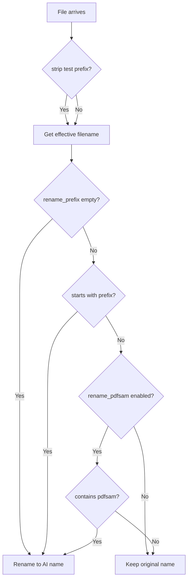

# Plan: Rename Files Containing "pdfsam"

## Problem

Currently, only files whose names **start with** the `rename_prefix` value (`"SCN"` by default) are renamed to their AI-suggested filenames. Files from the pdfsam.com PDF splitting tool (e.g., `pdfsam_basic_12345.pdf`, `PdfSam_001.pdf`) are **kept with their original names** even though they should be renamed.

## Solution

Extend the renaming logic to also rename files that **contain** `"pdfsam"` (case-insensitive) in their filename, in addition to files that **start with** `"SCN"`.

## Files to Modify

| File | Changes |
|------|---------|
| [`src/config_manager.py`](src/config_manager.py:143-150) | Add `rename_pdfsam` config property |
| [`pipeline.py`](pipeline.py:1628-1652) | Update renaming logic in `process_all()`, `process_searchable()`, and `collect_simulation_row()` |
| [`config.yaml`](config.yaml:6) | Document the new option |

## Detailed Changes

### 1. ConfigManager (`src/config_manager.py`)

Add a new property after the existing `rename_prefix` property (around line 150):

```python
@property
def rename_pdfsam(self) -> bool:
    """
    Whether to rename files containing 'pdfsam' in their name.
    When True, files like 'pdfsam_basic_12345.pdf' will be renamed
    to their AI-suggested filename, in addition to SCN-prefixed files.
    Default: True.
    """
    return self.get("pipeline.rename_pdfsam", True)
```

### 2. Helper Function (`src/config_manager.py` or `pipeline.py`)

Create a helper function to determine if a file should be renamed:

```python
def should_rename_file(effective_filename: str, config: ConfigManager) -> bool:
    """
    Determine if a file should be renamed based on its name and config.
    
    Args:
        effective_filename: Filename with test prefix stripped (if in test mode).
        config: Pipeline configuration.
    
    Returns:
        True if the file should be renamed to AI-suggested name.
    """
    rename_prefix = config.rename_prefix
    
    # If rename_prefix is empty, rename ALL files
    if not rename_prefix:
        return True
    
    # Check if filename starts with the prefix (e.g., "SCN")
    if effective_filename.startswith(rename_prefix):
        return True
    
    # Check if rename_pdfsam is enabled and filename contains "pdfsam"
    if config.rename_pdfsam:
        # Case-insensitive check for "pdfsam" anywhere in the filename
        if "pdfsam" in effective_filename.lower():
            return True
    
    return False
```

### 3. Update `process_all()` (`pipeline.py` ~lines 1622-1652)

**Current logic:**
```python
rename_prefix = config.rename_prefix
if rename_prefix:
    if effective_filename.startswith(rename_prefix):
        final_filename = f"{suggested_filename}.pdf"
    else:
        final_filename = filename
else:
    final_filename = f"{suggested_filename}.pdf"
```

**New logic:**
```python
rename_prefix = config.rename_prefix
if should_rename_file(effective_filename, config):
    if rename_prefix and not effective_filename.startswith(rename_prefix):
        # It's a pdfsam file
        final_filename = f"{suggested_filename}.pdf"
        logger.info(
            "Filename renamed: %s → %s (pdfsam pattern matched)",
            filename,
            final_filename,
        )
    else:
        final_filename = f"{suggested_filename}.pdf"
        logger.info(
            "Filename renamed: %s → %s (prefix '%s' matched)",
            filename,
            final_filename,
            rename_prefix,
        )
else:
    final_filename = filename
    logger.info(
        "Filename kept: %s (no prefix match, pdfsam disabled)",
        filename,
    )
```

### 4. Update `process_searchable()` (`pipeline.py` ~lines 2052-2081)

Apply the same logic as `process_all()`.

### 5. Update `collect_simulation_row()` (`pipeline.py` ~lines 378-391)

Update the simulation row collection to use the same logic:

```python
if should_rename_file(effective_filename, config):
    final_filename = f"{suggested}.pdf"
else:
    final_filename = filename
```

### 6. Update `config.yaml`

Add the new option (documented):

```yaml
pipeline:
  rename_prefix: "SCN"        # Files starting with this prefix will be renamed
  rename_pdfsam: true          # Also rename files containing "pdfsam" (case-insensitive)
```

## Behavior Matrix

| Filename | `rename_prefix` | `rename_pdfsam` | Result |
|----------|-----------------|-----------------|--------|
| `SCN_0042.pdf` | `"SCN"` | `true` | **Renamed** (prefix match) |
| `pdfsam_basic_12345.pdf` | `"SCN"` | `true` | **Renamed** (pdfsam match) |
| `PdfSam_001.pdf` | `"SCN"` | `true` | **Renamed** (pdfsam match, case-insensitive) |
| `my_document.pdf` | `"SCN"` | `true` | **Kept** (no match) |
| `pdfsam_basic_12345.pdf` | `"SCN"` | `false` | **Kept** (pdfsam disabled) |
| `SCN_0042.pdf` | `"SCN"` | `false` | **Renamed** (prefix match) |
| `anything.pdf` | `""` | `true` | **Renamed** (empty prefix = all) |

## Log Message Examples

| Scenario | Log Message |
|----------|-------------|
| SCN file renamed | `Filename renamed: SCN_0042.pdf → Facture_Orange_2024_Mars.pdf (prefix 'SCN' matched)` |
| pdfsam file renamed | `Filename renamed: pdfsam_basic_12345.pdf → Facture_Orange_2024_Mars.pdf (pdfsam pattern matched)` |
| File kept | `Filename kept: my_document.pdf (prefix 'SCN' not matched on 'my_document')` |

## Mermaid Flow Diagram



## Implementation Order

1. Add `rename_pdfsam` property to `ConfigManager`
2. Add `should_rename_file()` helper function
3. Update `process_all()` renaming logic
4. Update `process_searchable()` renaming logic
5. Update `collect_simulation_row()` renaming logic
6. Update log messages for clarity
7. Update `config.yaml` documentation
