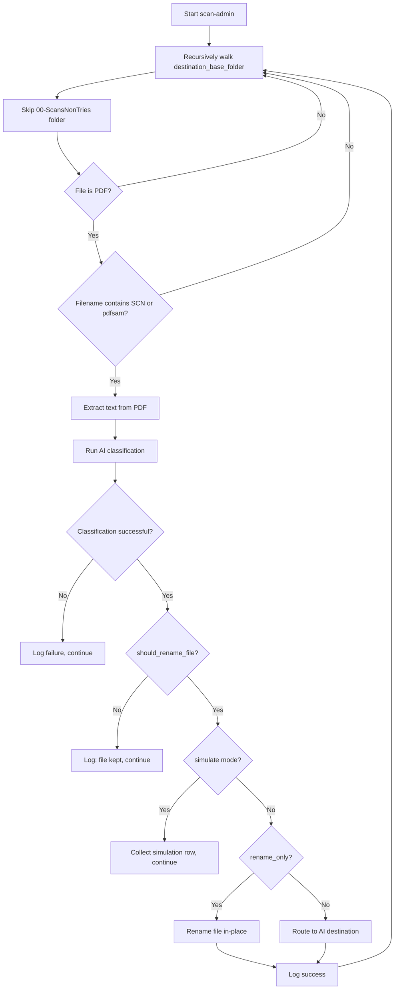

# Plan: Scan Administrative Folder for SCN/pdfsam Files and Rename Them

## Problem

Files like `13_pdfsam_scan_0003.pdf` end up in the administrative folder (`/Volumes/Administratif`) with their original scanner-generated names. The current pipeline only processes files from:
- `raw_scans_folder` (`/Volumes/Public/-ScansImprimante`) via `--process`
- `searchable_pdf_folder` (`/Volumes/Administratif/00-ScansNonTries`) via `--process-searchable`

Files already placed inside person/category folders (e.g., `30-Eric/20-Achats&Fournisseurs/13_pdfsam_scan_0003.pdf`) are never revisited for renaming.

## Solution

Add a new CLI flag `--scan-admin` that:
1. Recursively walks the entire `destination_base_folder` (`/Volumes/Administratif`)
2. Finds PDF files whose names contain `SCN` or `pdfsam` (case-insensitive)
3. Runs OCR text extraction + AI classification on each matching file
4. Uses the existing `should_rename_file()` to determine if renaming is needed
5. Renames the file **in-place** (or routes to correct destination if classification suggests a different person/category)
6. Supports `--simulate` mode for preview

## Files to Modify

| File | Changes |
|------|---------|
| [`pipeline.py`](pipeline.py) | Add `scan_admin_folder()` function + CLI argument |
| [`config.yaml`](config.yaml) | No changes needed (reuses existing config) |

## Design Decisions

### 1. In-place rename vs. re-routing

Two options for what to do with found files:

| Option | Behavior | Pros | Cons |
|--------|----------|------|------|
| **A: Rename in-place** | Keep file in current folder, just change filename | Safe, minimal disruption | File might be in wrong category folder |
| **B: Re-route to correct destination** | Move file to AI-suggested person/category with correct name | Fixes both name AND location | More disruptive, could move files user placed intentionally |

**Recommendation: Offer both modes via a flag. Default to in-place rename (`--rename-only`), with option to re-route (`--reroute`).**

### 2. Reusing existing code (NO duplication)

The following existing functions will be reused directly:

| Function | Location | Used For |
|----------|----------|----------|
| `should_rename_file()` | [`pipeline.py:98`](pipeline.py:98) | Check if file matches SCN/pdfsam pattern |
| `collect_simulation_row()` | [`pipeline.py:362`](pipeline.py:362) | Build simulation preview rows |
| `print_simulation_table()` | [`pipeline.py:459`](pipeline.py:459) | Display simulation results |
| `route_to_destination()` | [`pipeline.py:199`](pipeline.py:199) | Route file to correct person/category |
| `build_destination_path()` | [`pipeline.py:138`](pipeline.py:138) | Build destination path string |
| `compute_sha256()` | [`pipeline.py:73`](pipeline.py:73) | Checksum verification |
| `OCREngine` | [`src/ocr_engine.py`](src/ocr_engine.py) | Text extraction from PDF |
| `AIClassifier` | [`src/ai_classifier.py`](src/ai_classifier.py) | AI classification |
| `write_reports()` | [`pipeline.py:831`](pipeline.py:831) | Generate success/failure reports |

### 3. Folder exclusion

The `00-ScansNonTries` folder should be **excluded** from the scan since it's already handled by `--process-searchable`. This avoids double-processing.

## Detailed Implementation

### New function: `scan_admin_folder()`

```python
def scan_admin_folder(
    config: ConfigManager,
    simulate: bool = False,
    rename_only: bool = True,
    report_dir: str = "",
) -> int:
    """
    Scan the entire administrative folder for files with SCN or pdfsam names,
    classify them via AI, and rename them in-place or re-route to correct destination.

    Args:
        config: Pipeline configuration.
        simulate: If True, show preview without making changes.
        rename_only: If True, rename file in-place (keep current folder).
                     If False, re-route to AI-suggested person/category.
        report_dir: Directory to write reports to.

    Returns:
        Number of files successfully processed.
    """
```

### Algorithm



### CLI Integration

Add to the argument parser in [`main()`](pipeline.py:2630):

```python
parser.add_argument(
    "--scan-admin",
    action="store_true",
    help=(
        "Scan the entire administrative folder for files with SCN or pdfsam "
        "names, classify them via AI, and rename them."
    ),
)
parser.add_argument(
    "--rename-only",
    action="store_true",
    default=True,
    help=(
        "When used with --scan-admin, rename files in-place without moving "
        "them to a different person/category folder. This is the default."
    ),
)
parser.add_argument(
    "--reroute",
    action="store_true",
    help=(
        "When used with --scan-admin, re-route files to the AI-suggested "
        "person/category folder instead of renaming in-place."
    ),
)
```

### In-place Rename Logic

When `rename_only=True`, instead of calling `route_to_destination()`, the function will:

1. Determine the new filename: `f"{suggested_filename}.pdf"`
2. Build the new path: `os.path.join(current_dir, new_filename)`
3. Check if destination filename already exists (avoid overwrites)
4. Use `os.rename()` to rename the file
5. Log the change

### Simulation Mode

When `--simulate` is used with `--scan-admin`:
- Walk the admin folder, find matching files
- Run text extraction + AI classification
- Call `collect_simulation_row()` for each file
- Display results via `print_simulation_table()`
- NO files are modified

### Report Generation

When `--report-dir` is specified:
- Generate success report listing all renamed/routed files
- Generate failure report listing files that couldn't be processed
- Reuse `write_reports()` from existing code

## Usage Examples

```bash
# Preview what would be renamed (simulation)
python pipeline.py --scan-admin --simulate

# Rename files in-place (default behavior)
python pipeline.py --scan-admin

# Re-route files to correct person/category
python pipeline.py --scan-admin --reroute

# With reports
python pipeline.py --scan-admin --report-dir logs/reports

# With custom config
python pipeline.py --scan-admin --config config.test.yaml
```

## Behavior Matrix

| Scenario | Flag | Action |
|----------|------|--------|
| File `SCN_0042.pdf` in `30-Eric/20-Achats/` | `--scan-admin` | Rename in-place to AI-suggested name |
| File `13_pdfsam_scan_0003.pdf` in `30-Eric/` | `--scan-admin` | Rename in-place to AI-suggested name |
| Same file | `--scan-admin --reroute` | Move to AI-suggested person/category with correct name |
| File `normal_document.pdf` | `--scan-admin` | Skipped (no SCN/pdfsam match) |
| File in `00-ScansNonTries/` | `--scan-admin` | Skipped (excluded folder) |

## Files NOT Modified

- [`src/config_manager.py`](src/config_manager.py) — No new config properties needed
- [`src/ocr_engine.py`](src/ocr_engine.py) — No changes needed
- [`src/ai_classifier.py`](src/ai_classifier.py) — No changes needed
- [`config.yaml`](config.yaml) — No changes needed (reuses existing settings)
- [`person_categories.yaml`](person_categories.yaml) — No changes needed

## Implementation Order

1. Add `scan_admin_folder()` function to [`pipeline.py`](pipeline.py) (after `process_searchable()` around line 2332)
2. Add CLI arguments `--scan-admin`, `--rename-only`, `--reroute` to [`main()`](pipeline.py:2630)
3. Add dispatch logic in [`main()`](pipeline.py:2840) to call `scan_admin_folder()` when `--scan-admin` is used
4. Update the help text/epilog in the argument parser