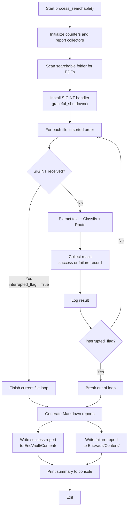
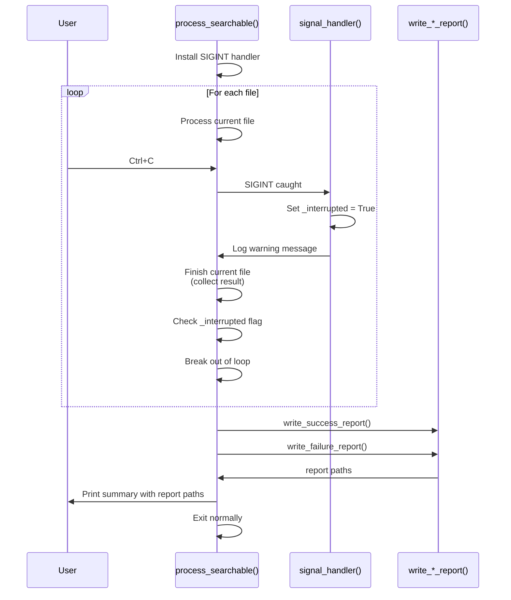

# Plan: Searchable Folder Treatment — Graceful Interruption + Markdown Reports

> **Goal**: Modify `process_searchable()` to:
> 1. Handle `Ctrl+C` gracefully — finish current file, then exit cleanly
> 2. Generate two Markdown report files at `/Users/ericandrianarison/Documents/EricVault/Content/`
>    - **Success report**: Files treated, where moved, new filename, confidence
>    - **Failure report**: Failed files with reasons to refine the prompt
>
> **Reports are written even if interrupted midway.**

---

## 1. Architecture & Flow



---

## 2. File 1 — Success Report

**Path**: `/Users/ericandrianarison/Documents/EricVault/Content/searchable_success_YYYY-MM-DD_HH-MM-SS.md`

**Columns**:

| Column | Content |
|--------|---------|
| # | Sequential index |
| Source File | Original filename from the searchable folder |
| Person | AI-identified person |
| Category | AI-identified category |
| Destination Path | Full path where the file was copied to |
| Final Filename | The filename after possible AI rename |
| Confidence | AI confidence score (0.00–1.00) |
| Status | `✅ Routed` or `⬇️ Not Routed` |

**Example**:

```markdown
# Searchable Folder Processing — Success Report

Generated: 2026-07-08 22:15:30
Total successful: 15 | Total processed: 1273

| # | Source File | Person | Category | Destination Path | Final Filename | Confidence | Status |
|---|------------|--------|----------|-----------------|---------------|------------|--------|
| 1 | SCN_0042.pdf | Eric | 20-Achats&Fournisseurs | /Volumes/Administratif/30-Eric/20-Achats&Fournisseurs/ | Facture_Orange_2024-03.pdf | 0.98 | ✅ Routed |
| 2 | SCN_0043.pdf | Famille | 90-Financier | /Volumes/Administratif/20-Famille/90-Financier/ | Releve_Bancaire_Compte_Conjoint_2024-06.pdf | 0.95 | ✅ Routed |
...
```

---

## 3. File 2 — Failure Report

**Path**: `/Users/ericandrianarison/Documents/EricVault/Content/searchable_failure_YYYY-MM-DD_HH-MM-SS.md`

**Columns**:

| Column | Content |
|--------|---------|
| # | Sequential index |
| Source File | Original filename |
| Failure Reason | Specific error message |
| AI Person | Person the AI guessed (if any) |
| AI Category | Category the AI guessed (if any) |
| AI Filename | Suggested filename from AI (if any) |
| Confidence | AI confidence score (if any) |
| Suggestion | Hint for prompt refinement |

**Failure reasons to capture**:

| Reason | When | Capture Fields |
|--------|------|---------------|
| `TEXT_EXTRACTION_FAILED` | `extract_text_direct()` returned error | error text |
| `CLASSIFICATION_FAILED` | AI call exception | exception message |
| `INVALID_PERSON_CATEGORY` | AI returned invalid person/category | person, category, confidence |
| `LOW_CONFIDENCE` | Confidence < threshold | person, category, suggested_filename, confidence |
| `ROUTING_FAILED` | `route_to_destination()` returned False | destination attempted |
| `NO_CLASSIFIER` | AI classifier not available | N/A |
| `NO_TEXT` | No text extracted, no AI run | N/A |

**Example**:

```markdown
# Searchable Folder Processing — Failure Report

Generated: 2026-07-08 22:15:30
Total failed: 3 | Total processed: 1273

| # | Source File | Failure Reason | AI Person | AI Category | AI Filename | Confidence | Suggestion |
|---|------------|---------------|-----------|-------------|------------|------------|------------|
| 1 | 090323 Facture boulanger tele Clarensac.pdf | INVALID_PERSON_CATEGORY | Clarensac | 20-Achats&Fournisseurs | N/A | 0.85 | Add 'Clarensac' as a known location or improve person detection rule for location names |
| 2 | 151125 GENERATION Carte 2016.pdf | INVALID_PERSON_CATEGORY | Famille | 80-Sante | N/A | 0.98 | Ensure '80-Sante' is listed under 'Famille' categories OR add it if missing |
| 3 | 240617 Ordonnance et docs Coloscopie_20240617220143.pdf | LOW_CONFIDENCE | Famille | 80-Sante | Facture_EDF_Electricite_Famille_Juin_2024.pdf | 0.97 | Wrong filename suggestion (coloscopy → electricity bill); improve document type detection |
```

The `Suggestion` column is auto-generated from basic heuristics per failure type:
- `INVALID_PERSON_CATEGORY`: "Person '[name]' not in hierarchy, or category '[cat]' not valid for that person. Consider adding to person_categories.yaml"
- `LOW_CONFIDENCE`: "Confidence [val] below threshold [thresh]. Consider lowering threshold or improving prompt rules."
- `TEXT_EXTRACTION_FAILED`: "File may be corrupt or password-protected. Verify manually."
- `CLASSIFICATION_FAILED`: "AI call error: [message]. Check Ollama availability."
- `ROUTING_FAILED`: "Destination copy/checksum failed. Check disk space and permissions."
- `NO_TEXT`: "No OCR text extracted. File may be image-only without text layer."
- `NO_CLASSIFIER`: "Ollama not reachable. Start Ollama and retry."

---

## 4. Implementation Details

### 4.1 Files to Modify

| File | Changes |
|------|---------|
| [`pipeline.py`](pipeline.py) | Add signal handler, reporting collector dicts, report generation functions, modify `process_searchable()` and `process_all()` |

### 4.2 New Functions to Add to `pipeline.py`

```python
import signal
import sys
from datetime import datetime

# Global interrupt flag
_interrupted = False

def signal_handler(sig, frame):
    """
    SIGINT handler — sets global flag for graceful shutdown.
    The current file processing completes, then reports are generated.
    """
    global _interrupted
    if not _interrupted:
        logger = logging.getLogger("pipeline")
        logger.warning(
            "\n⚠️  SIGINT received. Finishing current file, "
            "then generating reports and exiting..."
        )
        _interrupted = True
    else:
        # Second Ctrl+C — force exit immediately
        logger.warning("⚠️  Second SIGINT received. Forcing immediate exit...")
        sys.exit(1)


def generate_report_filename(prefix: str) -> str:
    """Generate a timestamped report filename."""
    timestamp = datetime.now().strftime("%Y-%m-%d_%H-%M-%S")
    return f"{prefix}_{timestamp}.md"


def write_success_report(
    results: list[dict],
    output_dir: str,
) -> str:
    """
    Write the success Markdown report.

    Args:
        results: List of success result dicts with fields:
            source_file, person, category, destination_path,
            final_filename, confidence, routed_successfully
        output_dir: Directory to write the report to.

    Returns:
        Path to the written report file.
    """
    report_path = os.path.join(
        output_dir, generate_report_filename("searchable_success")
    )
    os.makedirs(output_dir, exist_ok=True)

    successful = [r for r in results if r.get("routed_successfully")]
    not_routed = [r for r in results if not r.get("routed_successfully")]

    with open(report_path, "w", encoding="utf-8") as f:
        f.write("# Searchable Folder Processing — Success Report\n\n")
        f.write(f"Generated: {datetime.now().strftime('%Y-%m-%d %H:%M:%S')}\n")
        f.write(f"Total successful: {len(successful)}")
        f.write(f" | Total not routed: {len(not_routed)}")
        f.write(f" | Total processed: {len(results)}\n\n")

        # ── Routed section ──
        if successful:
            f.write("## ✅ Routed Files\n\n")
            f.write(
                "| # | Source File | Person | Category | "
                "Destination Path | Final Filename | Confidence |\n"
            )
            f.write(
                "|---|------------|--------|----------|"
                "-----------------|---------------|------------|\n"
            )
            for i, row in enumerate(successful, 1):
                f.write(
                    f"| {i} "
                    f"| {row['source_file']} "
                    f"| {row['person']} "
                    f"| {row['category']} "
                    f"| {row['destination_path']} "
                    f"| {row['final_filename']} "
                    f"| {row['confidence']:.2f} |\n"
                )

        # ── Not routed section (high confidence but routing failed) ──
        if not_routed:
            f.write("\n## ⬇️ Not Routed (High Confidence, Routing Failed)\n\n")
            f.write(
                "| # | Source File | Person | Category | "
                "Destination Path | Final Filename | Confidence |\n"
            )
            f.write(
                "|---|------------|--------|----------|"
                "-----------------|---------------|------------|\n"
            )
            for i, row in enumerate(not_routed, 1):
                f.write(
                    f"| {i} "
                    f"| {row['source_file']} "
                    f"| {row['person']} "
                    f"| {row['category']} "
                    f"| {row['destination_path']} "
                    f"| {row['final_filename']} "
                    f"| {row['confidence']:.2f} |\n"
                )

    logger = logging.getLogger("pipeline")
    logger.info("Success report written to: %s", report_path)
    return report_path


def write_failure_report(
    failures: list[dict],
    confidence_threshold: float,
    output_dir: str,
) -> str:
    """
    Write the failure Markdown report.

    
    Args:
        failures: List of failure result dicts with fields:
            source_file, failure_reason, ai_person, ai_category,
            ai_filename, confidence, error_details
        confidence_threshold: The confidence threshold used.
        output_dir: Directory to write the report to.

    Returns:
        Path to the written report file.
    """
    report_path = os.path.join(
        output_dir, generate_report_filename("searchable_failure")
    )
    os.makedirs(output_dir, exist_ok=True)

    with open(report_path, "w", encoding="utf-8") as f:
        f.write("# Searchable Folder Processing — Failure Report\n\n")
        f.write(f"Generated: {datetime.now().strftime('%Y-%m-%d %H:%M:%S')}\n")
        f.write(f"Total failed: {len(failures)}")
        f.write(f" | Confidence threshold: {confidence_threshold:.2f}\n\n")
        f.write(
            "| # | Source File | Failure Reason | AI Person | "
            "AI Category | AI Filename | Confidence | Suggestion |\n"
        )
        f.write(
            "|---|------------|---------------|-----------|"
            "-------------|------------|------------|------------|\n"
        )

        for i, row in enumerate(failures, 1):
            # Generate suggestion based on failure reason
            suggestion = _generate_suggestion(row, confidence_threshold)

            conf_str = (
                f"{row['confidence']:.2f}"
                if row.get("confidence") is not None
                else "N/A"
            )

            f.write(
                f"| {i} "
                f"| {row['source_file']} "
                f"| {row['failure_reason']} "
                f"| {row.get('ai_person', 'N/A')} "
                f"| {row.get('ai_category', 'N/A')} "
                f"| {row.get('ai_filename', 'N/A')} "
                f"| {conf_str} "
                f"| {suggestion} |\n"
            )

    logger = logging.getLogger("pipeline")
    logger.info("Failure report written to: %s", report_path)
    return report_path


def _generate_suggestion(failure: dict, threshold: float) -> str:
    """Generate a human-readable suggestion for prompt refinement."""
    reason = failure.get("failure_reason", "")

    if reason == "INVALID_PERSON_CATEGORY":
        person = failure.get("ai_person", "?")
        category = failure.get("ai_category", "?")
        return (
            f"Person '{person}' not in hierarchy, or category '{category}' "
            f"not valid for that person. Consider adding to person_categories.yaml "
            f"or improving person detection rules in the prompt."
        )
    elif reason == "LOW_CONFIDENCE":
        conf = failure.get("confidence", 0.0)
        return (
            f"Confidence {conf:.2f} below threshold {threshold:.2f}. "
            f"Consider lowering threshold or improving document type "
            f"detection rules in the prompt."
        )
    elif reason == "TEXT_EXTRACTION_FAILED":
        return (
            "File may be corrupt or password-protected. "
            "Verify the file manually and re-scan if needed."
        )
    elif reason == "CLASSIFICATION_FAILED":
        return (
            "AI call error. Check Ollama availability and model health "
            f"({failure.get('error_details', '')})."
        )
    elif reason == "ROUTING_FAILED":
        return (
            "Destination copy or checksum verification failed. "
            "Check disk space, permissions, and destination volume mount."
        )
    elif reason == "NO_TEXT":
        return (
            "No OCR text could be extracted. File may be an image-only scan "
            "without a text layer, or OCR failed."
        )
    elif reason == "NO_CLASSIFIER":
        return (
            "Ollama server not reachable. Start Ollama with 'ollama serve' "
            "and ensure model 'qwen2.5:7b' is pulled."
        )
    else:
        return (
            f"Unhandled failure reason: {reason}. "
            f"Review logs for more details."
        )
```

### 4.3 Modified `process_searchable()` — Key Changes

Inside `process_searchable()`, before the file loop:

```python
# ── Install SIGINT handler for graceful shutdown ────────────
global _interrupted
_interrupted = False
original_handler = signal.signal(signal.SIGINT, signal_handler)
```

After the file loop completes or is interrupted:

```python
# ── Generate Markdown reports ───────────────────────────────
report_output_dir = "/Users/ericandrianarison/Documents/EricVault/Content"
success_report = write_success_report(
    all_results, report_output_dir
)
failure_report = write_failure_report(
    failure_records, config.ai_confidence_threshold, report_output_dir
)

# Print summary
print("\n" + "=" * 70)
print("  REPORTS GENERATED")
print("=" * 70)
print(f"  Success: {success_report}")
print(f"  Failure: {failure_report}")
print("=" * 70 + "\n")

# Reinstall original signal handler
signal.signal(signal.SIGINT, original_handler)

if _interrupted:
    logger.warning("Pipeline interrupted by user. Reports were saved.")
```

### 4.4 Data Collection Structures

Add these collectors alongside existing counters in `process_searchable()`:

```python
all_results: list[dict] = []    # All processed files (for success report)
failure_records: list[dict] = [] # Failed files (for failure report)
```

**Success record** (appended when classification succeeds — routed or not):

```python
all_results.append({
    "source_file": filename,
    "person": person,
    "category": category,
    "destination_path": str(dest_path),
    "final_filename": str(final_filename),
    "confidence": confidence,
    "routed_successfully": should_route and routing_ok,
})
```

**Failure record** (appended when anything goes wrong):

```python
failure_records.append({
    "source_file": filename,
    "failure_reason": "<REASON_CODE>",
    "ai_person": person_str or "",
    "ai_category": category_str or "",
    "ai_filename": suggested_str or "",
    "confidence": conf_float,
    "error_details": error_message,
})
```

### 4.5 Report Output Directory

The directory `/Users/ericandrianarison/Documents/EricVault/Content/` is created automatically if it doesn't exist (via `os.makedirs(output_dir, exist_ok=True)` inside the report-writing functions).

---

## 5. Graceful Interruption Flow



---

## 6. Error Cases & Edge Cases

| Scenario | Behavior |
|----------|----------|
| **Ctrl+C mid-file** (before `route_to_destination`) | Current file result collected as-is; loop breaks; reports generated |
| **Ctrl+C during report writing** | Report writing is fast enough to complete; if interrupted, partial file is written (best-effort) |
| **Second Ctrl+C** | Forces immediate `sys.exit(1)` — no report, no cleanup |
| **Output directory doesn't exist** | `os.makedirs(output_dir, exist_ok=True)` creates it |
| **Empty searchable folder** | Reports generated with 0 entries |
| **All files succeed** | Failure report has 0 entries (header only) |
| **All files fail** | Success report has 0 entries (header only) |
| **Very long file list** | Reports are written incrementally as a single write at the end, so no issue |
| **Unicode filenames** | Handled via `encoding="utf-8"` in file writes |

---

## 7. Compatibility with `process_all()`

The same approach applies to `process_all()` for consistency. The `_interrupted` flag and report-writing functions are shared. Add a new `--report-dir` CLI argument to optionally override the report output directory.

### CLI changes

```python
parser.add_argument(
    "--report-dir",
    type=str,
    default="/Users/ericandrianarison/Documents/EricVault/Content",
    help="Directory to write Markdown report files (default: ~/Documents/EricVault/Content)",
)
```

Both `process_all()` and `process_searchable()` receive the `report_dir` parameter.

---

## 8. Summary of Changes to `pipeline.py`

| What | Where | Lines |
|------|-------|-------|
| Add `import signal` | Top of file | ~line 20 |
| Import `datetime` from `datetime` | Top of file | ~line 18 |
| Add global `_interrupted` flag | After imports | new |
| Add `signal_handler()` function | New helper section | new |
| Add `generate_report_filename()` | New helper section | new |
| Add `_generate_suggestion()` | New helper section | new |
| Add `write_success_report()` | New helper section | new |
| Add `write_failure_report()` | New helper section | new |
| Add `--report-dir` CLI argument | `main()` parser | new |
| Modify `process_all()` | Add collectors, signal handler, reports | modified |
| Modify `process_searchable()` | Add collectors, signal handler, reports | modified |
| Pass `report_dir` from `main()` to both functions | `main()` | modified |

---

## 9. Acceptance Criteria

| # | Criterion | Pass/Fail |
|---|-----------|-----------|
| 1 | Ctrl+C during processing: current file finishes, loop breaks | |
| 2 | Success report `.md` file created at `/Users/ericandrianarison/Documents/EricVault/Content/` | |
| 3 | Failure report `.md` file created at the same location | |
| 4 | Reports contain all expected columns per Section 2 and 3 | |
| 5 | Failure report has a helpful `Suggestion` column for prompt refinement | |
| 6 | Reports are generated even after Ctrl+C interruption | |
| 7 | Second Ctrl+C forces immediate exit | |
| 8 | `--report-dir` CLI argument overrides default output directory | |
| 9 | No files are lost or corrupted during interruption | |